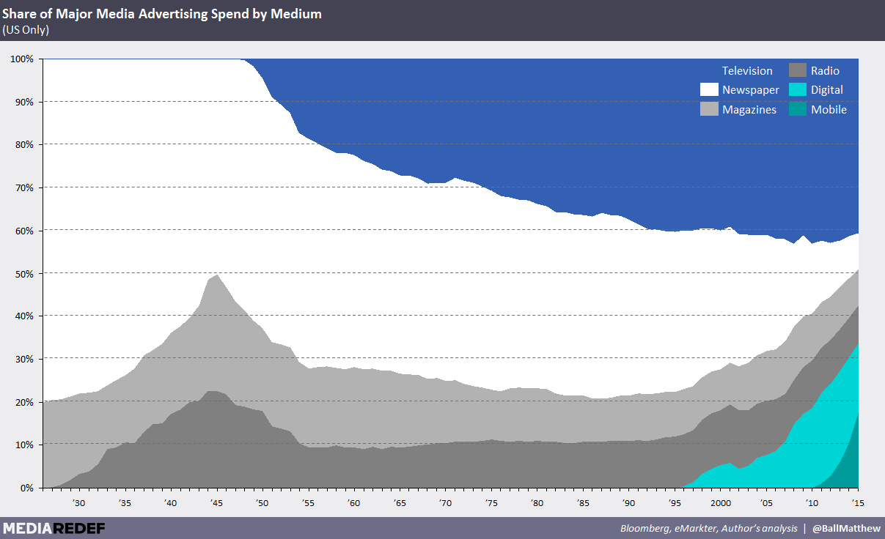
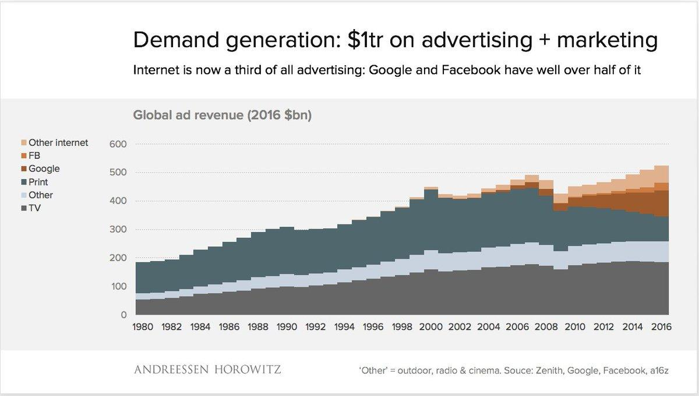
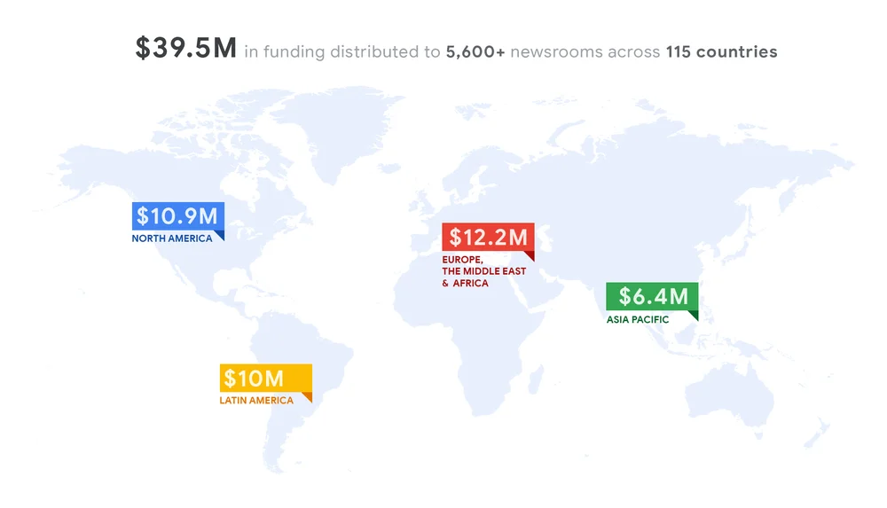
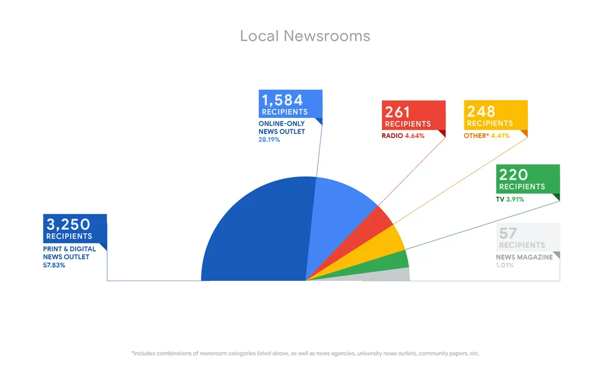
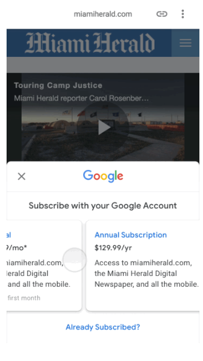
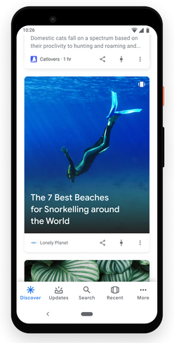

# I Information retrival

Also see:&#x20;







## **I.I Newspaper (1650\[1])**&#x20;

## **I.II Manual index web search (< 1993\[1])**&#x20;

_<mark style="background-color:orange;">Source: s. \[MindS.I] https://www.quora.com/How-did-people-search-on-the-web-before-search-engines-were-created, Answer of Tom Peracchio, Matthew Petach, Richard Conto, Stan Hanks , retrieved on 17.05.2023</mark>_

_\[GPT.MindS.I], gpt-4-0314(temp = 0,top\_p=1), valid till: 09.2021, 17.06.2023_

Context: Quora question: "How did people search on the web before search engines were created?"

**Part I -** [**Tom Peracchio**](https://www.quora.com/profile/Tom-Peracchio) **answer**

<mark style="color:blue;">**Q:**</mark> <mark style="color:blue;"></mark><mark style="color:blue;">\[Research query documented in chapter 3., Text: source part, Service name: Manual index search]</mark>

<mark style="color:blue;">**A:**</mark> <mark style="color:blue;"></mark><mark style="color:blue;">Before search engines, directories like Yahoo! were prevalent in the mid-1990s, fulfilling similar functions in communication. These directories were influenced by the social environment of the time, which relied heavily on telephone directories for finding information. However, these prevalent services had disadvantages such as limited search capabilities and a lack of organization. People preferred using digital services like Yahoo! and AltaVista because they offered more efficient and organized ways to find information. The rise of the internet and the decline of traditional communication methods like rotary phones and telephone directories contributed to the growth of digital services and the decline of prevalent services. The digital services changed how people communicated by providing faster and more convenient ways to access information.</mark>

**Part II -** [**Matthew Petach**](https://www.quora.com/profile/Matthew-Petach) **answer**

<mark style="color:blue;">**Q:**</mark> <mark style="color:blue;"></mark><mark style="color:blue;">\[Research query documented in chapter 3., Text: source part, Service name: Manual index search]</mark>

<mark style="color:blue;">**A:**</mark> <mark style="color:blue;"></mark><mark style="color:blue;">The text discusses the early days of the internet when a simple directory was sufficient to keep track of websites. Services like Akebono at Stanford University provided categorized directories of web pages. As the number of sites grew, search engines like AltaVista, Inktomi, and Excite@Home emerged, using web spiders to crawl and index websites. However, these early search engines were simplistic and often provided frustrating and useless search results.</mark>

<mark style="color:blue;">I.III: The disadvantages of the prevalent services included their simplicity, limited capacity to keep track of the growing number of websites, and the often frustrating and useless search results they provided.</mark>

<mark style="color:blue;">I.IV: People preferred using these early search engines over directories because they offered a more comprehensive index of websites and the ability to search for specific content.</mark>

<mark style="color:blue;">III.I: Positive consequences of using these early search engines included easier access to information and a more comprehensive index of websites.</mark>

<mark style="color:blue;">III.II: Negative consequences of using these early search engines included frustrating and often useless search results due to their simplistic nature.</mark>

<mark style="color:blue;">IV.I: User benefits of these early search engines included easier access to information and a more comprehensive index of websites. Disadvantages included frustrating and often useless search results.</mark>

<mark style="color:blue;">IV.II: The overall perception of the user to these early search engines is not mentioned in the text.</mark>

**Part III - Richard Conto answer**

<mark style="color:blue;">**Q:**</mark> <mark style="color:blue;"></mark><mark style="color:blue;">\[Research query documented in chapter 3., Text: source part, Service name: Manual index search]</mark>

<mark style="color:blue;">**A:**</mark> <mark style="color:blue;"></mark><mark style="color:blue;">Before search engines like Google, there were various information sharing services on the Internet, such as NNTP, UUCP, Gopher, FTP, and email. People would often publish pages of links to things, and in some cases, send requests via email to see a directory of retrievable items. Users would also subscribe to information distribution lists to search for content.</mark>

**Part IV - Stan Hanks answer**

<mark style="color:blue;">**A:**</mark> <mark style="color:blue;"></mark><mark style="color:blue;">Before the creation of digital services like manual index web search, people relied on libraries, librarians, and physical documents like books and academic papers to find information.</mark>&#x20;

<mark style="color:blue;">The social environment at the time was more focused on personal interactions and relationships with experts in various fields.</mark>

&#x20;<mark style="color:blue;">Disadvantages of the prevalent services included the time-consuming nature of searching for information, the difficulty in accessing certain materials, and the reliance on physical copies of documents. People may have preferred using digital services for their speed, convenience, and ability to access a wider range of information.</mark>&#x20;

<mark style="color:blue;">The rise of digital services was influenced by the values and concepts of human life and society, such as the desire for efficiency and the importance of communication.</mark>&#x20;

<mark style="color:blue;">The use of digital services has both positive and negative consequences for individuals, groups, and society as a whole.</mark>&#x20;

<mark style="color:blue;">Positive consequences include easier access to information and improved communication, while negative consequences may include the loss of personal interactions and the potential for intrusive data collection. The overall perception of users towards digital services like manual index web search is not mentioned in the text.</mark>

_<mark style="background-color:orange;">Source: s. \[MindS.II]  https://ayushj.substack.com/p/the-evolution-of-search-past-present,retrieved on 17.05.2023</mark>_

_\[GPT.MindS.II], gpt-4-0314(temp = 0,top\_p=1), valid till: 09.2021, 17.06.2023_

**Part I - Till Subheading "Carousel":**

<mark style="color:blue;">**Q:**</mark> <mark style="color:blue;"></mark><mark style="color:blue;">\[Research query documented in chapter 3., Text: part of source, Service: Manual index web search]</mark>

<mark style="color:blue;">**A:**</mark> <mark style="color:blue;"></mark><mark style="color:blue;">In the early days of the internet, manual index web search services like Archie, Veronica, and Jughead were prevalent, created in 1990 and 1991 respectively.</mark>&#x20;

<mark style="color:blue;">These services fulfilled similar functions in communication by indexing public files and file names, but they did not use web crawlers and were dependent on a list of websites. The social environment at the time influenced the development of these services as people needed a way to find and access information on the growing web.</mark>

<mark style="color:blue;">However, these early search engines had disadvantages, such as limited space and the inability to index the content of sites, making them prone to spamming and decreasing the relevance of their results. People began to prefer using services like Google over the prevalent ones because of its unique citation-based ranking system, which provided more relevant and trustworthy search results.</mark>

<mark style="color:blue;">The rise of Google and other advanced search engines provided an advantage in the market by offering features like natural language queries, unlimited bandwidth, and advanced search features. This led to the decline of manual index web search services as they could not compete with the efficiency and accuracy of newer search engines. The digital service of web search engines like Google changed how people communicated by making information more accessible and organized, leading to an index-based approach to browsing information.</mark>

<mark style="color:blue;">The values and concepts of human life and society influenced the developers of these services by prioritizing relevance, trustworthiness, and efficiency in search results. The positive consequences of using these services include easier access to information, faster communication, and a more organized way of browsing the web. However, negative consequences may include an over-reliance on search engines and a decrease in the depth of knowledge gained from browsing information.</mark>

<mark style="color:blue;">The overall perception of users towards services like Google is generally positive due to their efficiency and accuracy in providing relevant search results.</mark>

**Part II - From Subheading "Algorithms " to end**

<mark style="color:blue;">**Q:**</mark> <mark style="color:blue;"></mark><mark style="color:blue;">\[Research query documented in chapter 3., Text: part of source, Service: Manual index web search]</mark>

<mark style="color:blue;">**A:**</mark> <mark style="color:blue;"></mark><mark style="color:blue;">The text does not provide enough information about manual index web search to answer the given questions.</mark>

_Note: Maybe revisit the source on Google. They had detailed information about changes in Googles search algorithm._

## **I.III Yahoo (1994)**&#x20;

_<mark style="background-color:orange;">Source: s. \[Yahoo.I]</mark>_ <mark style="background-color:orange;"></mark><mark style="background-color:orange;">https://pulse2.com/the-current-state-of-yahoo-and-where-yahoos-acquisitions-since-1997-are-now/,</mark> <mark style="background-color:orange;"></mark>_<mark style="background-color:orange;">retrieved on 17.05.2023</mark>_

_\[GPT.Yahoo.I], gpt-4-0314(temp = 0,top\_p=1), valid till: 09.2021, 17.06.2023_

**Part I - Until subheading 15. Arthas.com**

<mark style="color:blue;">**Q:**</mark> <mark style="color:blue;"></mark><mark style="color:blue;">\[Research query documented in chapter 3., Text: part of source, Service: Yahoo]</mark>

<mark style="color:blue;">**A:**</mark> <mark style="color:blue;"></mark><mark style="color:blue;">Yahoo has acquired several companies over the years, including Net Controls Corporation, Four11, Classic Games, Viaweb, WebCal Corporation, Yoyodyne Entertainment, Sportasy, HYPERParallel, Log-Me-On.com, GeoCities.com, Encompass, Online Anywhere, Broadcast.com, Innovative Systems Services Group, and Arthas.com. These acquisitions have helped Yahoo expand its services and user base, offering a variety of communication and social media platforms.</mark>

<mark style="color:blue;">I.II The social environment at the time of these acquisitions was characterized by a growing interest in online communication, social media, and digital services. This influenced the development of these services as they aimed to fulfill the needs and desires of users in this evolving digital landscape.</mark>

<mark style="color:blue;">I.III Some disadvantages of the prevalent services at the time included limited functionality, lack of integration with other platforms, and a lack of user-friendly features.</mark>

<mark style="color:blue;">I.IV People may have preferred using Yahoo's acquired services over the prevalent ones due to their innovative features, ease of use, and integration with other popular platforms.</mark>

<mark style="color:blue;">I.V Factors that provided an advantage to Yahoo's acquired services in the market included their unique offerings, user-friendly interfaces, and the backing of a well-established company like Yahoo.</mark>

<mark style="color:blue;">III.I Positive consequences of using these services for individuals, groups, and society include increased communication options, the ability to share and discover new content, and the fostering of online communities.</mark>

<mark style="color:blue;">III.II Negative consequences of using these services for individuals, groups, and society may include potential privacy concerns, the spread of misinformation, and the potential for online harassment or bullying.</mark>

<mark style="color:blue;">III.III The digital services acquired by Yahoo have changed how people communicate by offering new platforms and tools for sharing information, connecting with others, and expressing oneself online.</mark>

<mark style="color:blue;">IV.I User benefits of these services may include increased communication options, the ability to discover new content, and the opportunity to connect with like-minded individuals. Disadvantages may include potential privacy concerns and the risk of online harassment or bullying.</mark>

**Part 2 - Subheading 16. e Groups - 30.  Stata Labs, Inc.**

<mark style="color:blue;">**Q:**</mark> <mark style="color:blue;"></mark><mark style="color:blue;">\[Research query documented in chapter 3., Text: part of source, Service: Yahoo]</mark>

<mark style="color:blue;">Yahoo! has acquired several companies and services throughout its history, including eGroups, Kimo, Sold.com.au, LAUNCH Media Inc., HotJobs, Cade, AlltheWeb, Inktomi, Overture, 3721 Internet Assistant, Kelkoo, Oddpost, The All-Seeing Eye, MusicMatch, Stata Labs, and more. These acquisitions have allowed Yahoo! to expand its offerings and reach in various markets, such as email management, search engines, online auctions, music services, job search, and gaming.</mark>

<mark style="color:blue;">Some of the prevalent services at the time of Yahoo!'s acquisitions included Hotmail, AltaVista, and Google. The social environment and the need for better communication tools influenced the development of these digital services. The disadvantages of the prevalent services included limited functionality, lack of customization, and slow search capabilities. People preferred using Yahoo!'s acquired services due to their improved features, faster search capabilities, and better user experience.</mark>

<mark style="color:blue;">The values and concepts of human life and society influenced the developers and the rise of their services by focusing on providing better communication tools, more efficient search engines, and improved user experience. The values and concepts from the start of development have evolved to focus on user privacy, data security, and personalized content.</mark>

<mark style="color:blue;">Positive consequences of using Yahoo!'s services include better communication, more efficient search results, and access to a wide range of content. Negative consequences include potential privacy concerns and data extraction issues. The digital services have changed how people communicate by providing faster and more efficient communication tools, such as email and instant messaging.</mark>

<mark style="color:blue;">Users may experience benefits such as improved communication, better search results, and access to a wide range of content. However, they may also face disadvantages such as privacy concerns and intrusive data collection. The overall perception of users towards Yahoo!'s services may vary, with some appreciating the improved features and others concerned about privacy issues. Despite potential dangers of data extraction and behavioral prediction, people may not act on these concerns due to convenience and the benefits provided by the services.</mark>

**Part 3 - subheading  31. Verdisoft till end**

<mark style="color:blue;">**Q:**</mark> <mark style="color:blue;"></mark><mark style="color:blue;">\[Research query documented in chapter 3., Text: part of source, Service: Yahoo]</mark>

<mark style="color:blue;">**A:**</mark>  <mark style="color:blue;"></mark><mark style="color:blue;">Yahoo has acquired several companies over the years, including VerdiSoft, Ludicorp Research (owner of Flickr), Stadeon, TeRespondo, Dialpad, Blo.gs, Konfabulator, Alibaba.com, Upcoming.org, Whereonearth, Del.icio.us, JumpCut, AdInterax, and Bix.com. These acquisitions have helped Yahoo expand its services and user base, offering a variety of communication and social media platforms.</mark>

<mark style="color:blue;">I.II The social environment at the time of these acquisitions was characterized by a growing interest in online communication, social media, and digital services. This influenced the development of these services as they aimed to fulfill the needs and desires of users in this evolving digital landscape.</mark>

<mark style="color:blue;">I.III Some disadvantages of the prevalent services at the time included limited functionality, lack of integration with other platforms, and a lack of user-friendly features.</mark>

<mark style="color:blue;">I.IV People may have preferred using Yahoo's acquired services over the prevalent ones due to their innovative features, ease of use, and integration with other popular platforms.</mark>

<mark style="color:blue;">I.V Factors that provided an advantage to Yahoo's acquired services in the market included their unique offerings, user-friendly interfaces, and the backing of a well-established company like Yahoo.</mark>

<mark style="color:blue;">III.I Positive consequences of using these services for individuals, groups, and society include increased communication options, the ability to share and discover new content, and the fostering of online communities.</mark>

<mark style="color:blue;">III.II Negative consequences of using these services for individuals, groups, and society may include potential privacy concerns, the spread of misinformation, and the potential for online harassment or bullying.</mark>

<mark style="color:blue;">III.III The digital services acquired by Yahoo have changed how people communicate by offering new platforms and tools for sharing information, connecting with others, and expressing oneself online.</mark>

<mark style="color:blue;">IV.I User benefits of these services may include increased communication options, the ability to discover new content, and the opportunity to connect with like-minded individuals. Disadvantages may include potential privacy concerns and the risk of online harassment or bullying.</mark>

_<mark style="background-color:orange;">Source: s. \[Yahoo.II] https://en.wikipedia.org/wiki/Yahoo!, till end of subheading '</mark>_<mark style="background-color:orange;">Decline, security breaches, and sale'</mark>_<mark style="background-color:orange;">,retrieved on 17.05.2023</mark>_

_\[GPT.Yahoo.II], gpt-4-0314(temp = 0,top\_p=1), valid till: 09.2021, 17.06.2023_

<mark style="color:blue;">**Q:**</mark> <mark style="color:blue;"></mark><mark style="color:blue;">\[Research query documented in chapter 3., Text: part of source, Service: Yahoo]</mark>

<mark style="color:blue;">**A:**</mark> <mark style="color:blue;"></mark><mark style="color:blue;">Yahoo was established in 1994 by Jerry Yang and David Filo, who were influenced by the social environment of the early internet era. At the time, Yahoo was a pioneer in providing a human-edited web directory, which was organized hierarchically and offered a search engine function. This was an advantage over other prevalent services, which were not as user-friendly or organized. People preferred using Yahoo due to its ease of use and comprehensive directory.</mark>

<mark style="color:blue;">The values and concepts of human life and society influenced the developers by focusing on providing a source of truth and wisdom through their hierarchical organization. Yahoo's initial success can be attributed to its rapid growth and expansion, as well as its acquisitions of other companies like RocketMail and Geocities.</mark>

<mark style="color:blue;">Positive consequences of using Yahoo include easy access to information, communication through Yahoo Mail, and a variety of services like Yahoo News, Finance, and Sports. However, negative consequences include the decline in usage due to competition from other tech giants like Google and Facebook, as well as security breaches that affected user data.</mark>

<mark style="color:blue;">Users may have experienced benefits such as convenience and a wide range of services, but also faced disadvantages like security concerns and the decline in popularity of the platform. The overall perception of Yahoo has changed over time, with its decline in usage and market share. Despite potential intrusive data collection, users may not act on the dangers of data extraction and behavioral prediction due to a lack of awareness or the convenience of the services provided.</mark>

<mark style="color:blue;">In summary, Yahoo was a pioneer in the early internet era, providing a user-friendly and organized web directory and search engine. Its growth and expansion were influenced by societal values and the need for accessible information. However, competition and security breaches led to its decline, and users now face both benefits and disadvantages when using the platform.</mark>

_<mark style="background-color:orange;">Source: s. \[Yahoo.III] https://web.archive.org/web/20080331063248/http://yhoo.client.shareholder.com/press/ReleaseDetail.cfm?ReleaseID=173399, retrieved on 17.05.2023</mark>_

_\[GPT.Yahoo.III], gpt-4-0314(temp = 0,top\_p=1), valid till: 09.2021, 17.06.2023_

<mark style="color:blue;">**Q:**</mark> <mark style="color:blue;"></mark><mark style="color:blue;">\[Research query documented in chapter 3., Text: part of source, Service: Yahoo]</mark>

<mark style="color:blue;">**A:**</mark> <mark style="color:blue;"></mark><mark style="color:blue;">In 1996, Yahoo launched Yahoo! Germany, a localized German version of its popular online guide to the Internet.</mark>&#x20;

<mark style="color:blue;">This service provided access to a comprehensive guide to German web sites, as well as the complete database of worldwide listings people have come to expect from Yahoo! At the time, Yahoo! was a leader in terms of traffic, receiving an average of 14 million page views per day as of September 1996. The German version of Yahoo! aimed to provide seamless access to the full directory listings of the main Yahoo! site, making it the first navigational site to provide a comprehensive listing of German sites and the rest of the World Wide Web.</mark>&#x20;

<mark style="color:blue;">Yahoo! Germany also carried services targeted to the needs of a German audience, such as headline news and full-text from Reuters, via German newsfeeds in business, sports, and general news. The popular "What's New", "What's Cool", and "Random" features of Yahoo! Germany were created by a local editorial team. Yahoo! Germany introduced a proven advertising platform for the German market, launching with German consumer and technology advertisers on board. Users of Yahoo! Germany could also access Yahoo!'s fully integrated Web-wide searching capabilities provided by Alta Vista. IBM joined forces with Yahoo! by providing server technology and IBM PCs to Yahoo! Germany. Yahoo! in Europe was powered by IBM servers to ensure that users continued to enjoy the rapid response times and service they had come to expect from Yahoo!</mark>

_<mark style="background-color:orange;">Source: s. \[Yahoo.IV] https://searchengineland.com/yahoo-directory-close-204370, retrieved on 17.05.2023</mark>_

_\[GPT.Yahoo.IV], gpt-4-0314(temp = 0,top\_p=1), valid till: 09.2021, 17.06.2023_

.png>)

<mark style="color:blue;">**Q:**</mark> <mark style="color:blue;"></mark><mark style="color:blue;">\[Research query documented in chapter 3., Text: part of source, Service: Yahoo]</mark>

<mark style="color:blue;">**A:**</mark> <mark style="color:blue;"></mark><mark style="color:blue;">Yahoo Directory was the most popular search engine on the web before Google came along in 1998. It was a hand-compiled list of websites organized into topics, and it was effective because there weren't many pages on the web at the time, and automated search technology wasn't very good. Yahoo Directory's main disadvantage was that it relied on humans to review websites, summarize them, and organize them into categories, which led to long delays in listing new sites and sometimes made sites effectively invisible. People preferred Google over Yahoo Directory because Google's search algorithm was better, and it allowed users to search through every page of every website, making it easier to find relevant information. The rise of Google and its partnership with Yahoo in 2000 led to the decline of Yahoo Directory, as Yahoo started presenting Google's search results as the main listings to searchers. This marked the beginning of Yahoo Directory's long, slow death, and it was eventually closed in 2014.</mark>

## **I.IV Google (1998)**

_Source: s. \[Google.1]_ [_https://www.investopedia.com/articles/personal-finance/042415/story-behind-googles-success.asp_](https://www.investopedia.com/articles/personal-finance/042415/story-behind-googles-success.asp)_, retrieved on 15.01.2023_

_\[GPT.Google.I], gpt-4-0314(temp = 0,top\_p=1), valid till: 09.2021, 29.06.2023_

<mark style="color:blue;">**Q:**</mark> <mark style="color:blue;"></mark><mark style="color:blue;">\[Research prompt V.1.1 ,documented in chapter 3. , Text: part of source, Service: Google search]</mark>

**Part 1 - from start to subheading till subheading Becoming a Digital Powerhouse**

<mark style="color:blue;">**A:**</mark> <mark style="color:blue;"></mark><mark style="color:blue;">I.I: N/A I.II: Google's original business focused on creating algorithms to help people sort quickly through the rapidly growing amount of content being put online. I.III: N/A I.IV: Google was able to serve up more accurate results than many of the existing search engines that preceded it in the market due to its scoring approach and constantly tweaked and updated algorithm. I.V: Google's method of prototyping and improving its products, starting with its search algorithm, contributed to its growth in the market. I.VI: N/A I.VII: N/A II.I: N/A II.II: N/A III.I: N/A III.II: N/A III.III: N/A IV.I: N/A IV.II: N/A IV.III: N/A</mark>

<mark style="color:blue;">Google's success can be attributed to its original focus on creating algorithms that helped users sort through the rapidly growing amount of online content (I.II). Its scoring approach and constantly updated algorithm allowed it to provide more accurate search results than its competitors (I.IV). Google's method of prototyping and improving its products, starting with its search algorithm, contributed to its growth in the market (I.V).</mark>

**Part 2 from subheading digital powerhouse to end**

<mark style="color:blue;">**A:**</mark> <mark style="color:blue;"></mark><mark style="color:blue;">I.I: Google Search (1998), Google Blogger (2003), Gmail (2004), Google Maps (2005), Google Finance (2006), YouTube (acquired 2006) I.IV: People prefer using Google services due to their constant improvement and innovation (e.g., autocomplete and instant results in Google Search, accurate pinpointing in Google Maps) I.V: Google's ad revenue allows them to invest in rapid prototyping of new ideas, which often grow into new sources of revenue I.VI: Google's failures include Google Video (washed away with the acquisition of YouTube) and Google+ (slowly phased out) II.I: Google's company culture is focused on innovating first, getting real user data second, and worrying about monetizing afterward III.I: Positive consequences include improved search capabilities, better mapping services, and access to a wide range of digital assets III.II: Negative consequences are not explicitly mentioned in the text III.III: The text does not specifically address how Google changed communication, but it does mention the improvement of search and mapping services IV.I: User benefits include improved search capabilities, better mapping services, and access to a wide range of digital assets; disadvantages are not explicitly mentioned in the text IV.II: The overall perception of Google services is positive, as they are preferred by most people in the world IV.III: The text does not discuss data extraction and behavioral prediction</mark>

<mark style="color:blue;">Summary: Google has become a digital powerhouse by constantly improving and innovating its services, such as Google Search, Google Maps, and YouTube (I.I, I.IV). The company's ad revenue allows them to invest in rapid prototyping of new ideas, which often grow into new sources of revenue (I.V).</mark> <mark style="color:blue;">Google's company culture is focused on innovating first, getting real user data second, and worrying about monetizing afterward (II.I). Users benefit from improved search capabilities, better mapping services, and access to a wide range of digital assets (IV.I). The overall perception of Google services is positive, as they are preferred by most people in the world (IV.II).</mark>

_Source: s. \[Google.2]_ [_https://www.quora.com/How-did-Google-become-a-big-company_](https://www.quora.com/How-did-Google-become-a-big-company)_, retrieved on 09.07.2023_

_\[GPT.Google.II], gpt-4-0614(temp = 0,top\_p=1), valid till: 09.2021, 09.07.2023_

<mark style="color:blue;">**Q:**</mark> <mark style="color:blue;"></mark><mark style="color:blue;">\[Research prompt V.1.2 ,documented in chapter 3. , Text: answer of Mano Vikram, Service: Google Search]</mark>

<mark style="color:blue;">**A:**</mark> <mark style="color:blue;"></mark><mark style="color:blue;">Summary: The text provides a detailed history of Google's development and growth. It explains that Google was born during the dot-com bubble, a time when having a business and a website could potentially make one a millionaire. This environment likely influenced the development of Google as a search engine, as there was a need for a tool to organize and rank the rapidly growing number of web pages (I.II). The text also mentions several factors that provided an advantage for Google to grow in the market. These include the dot-com crash, which made real estate cheaper and opened up a pool of talented individuals who had lost their jobs; the introduction of keyword ads, which provided a revenue stream; and the expansion into other markets, such as email services, which increased user engagement (I.V). However, the text does not provide answers to many of the questions, including those about the disadvantages of prevalent services, why people prefer using Google over these services, and how Google changed how people communicate.</mark>

<mark style="color:blue;">**Q:**</mark> <mark style="color:blue;"></mark><mark style="color:blue;">\[Research prompt V.1.2 ,documented in chapter 3. , Text: How did Google rise to power so quickly - answer of Peter White, Service: Google Search]</mark>

<mark style="color:blue;">**A:**</mark> <mark style="color:blue;"></mark><mark style="color:blue;">The standard answer is better algorithms for search results. I am not going to claim that is wrong. But I do wonder if it really was the most important reason. I am going to offer a different answer: Marissa Mayers demanding a clean and simple front page for Google.</mark>

<mark style="color:blue;">Back in the late 90s, 28 kbaud modems were the norm. 56kbaud modems were coming out, so if you were a techie, yes, you definitely bought one of them. But the “typical” person with a computer still had a 28 or even a 14 kbaud modem.</mark>

<mark style="color:blue;">In the late 90s I found myself in a cash crunch due personal life changes I will not go into. So I gratefully accepted an older hand me down computer with a 14 kbaud modem from a relative. I was also someone who was used to using Yahoo. Guess what it was like trying to look up a movie showing on Yahoo? Torture! It literally took 2–3 minutes to load up the Yahoo front page, so I could even click on something that would take me to the movie listing page.</mark>

<mark style="color:blue;">The CEO of Yahoo was very consciously grooming the Yahoo front page as the be all and end all of content portals for the new era. It is said he was literally reviewing the page every morning to see that lots of wonderful stuff was efficiently packed onto the front page. He had his top designers squeezing as much content (and performance sucking ads) as possible on that front page.</mark>

<mark style="color:blue;">If you were someone with a new computer and a high speed connection, which would be 99% of the tech workers in Silicon Valley and many young engineering students at university, the Yahoo page loaded up just fine. So you might choose between Yahoo and Google based on quality of results.</mark>

<mark style="color:blue;">But “typical” people may have had an experience more similar to mine. And now to Marissa Mayer’s contribution… The very lean looking Google front page loaded instantly, and the follow up page of links was fast, too. Thus I could get an answer to a simple question like what is the showing times of that movie in <1 minute. In contrast, it took 3–5 minutes to accomplish the same on Yahoo.</mark>

<mark style="color:blue;">Did Google rise so quickly because of better results? Or because of a better experience in the specific context of its critical early years? I suspect the standard explanation is not the full truth.</mark>

<mark style="color:blue;">**Q:**</mark> <mark style="color:blue;"></mark><mark style="color:blue;">\[Research prompt V.1.2 ,documented in chapter 3. , Text:</mark> [Is Google the most powerful company in the history of mankind?](https://www.quora.com/Is-Google-the-most-powerful-company-in-the-history-of-mankind)<mark style="color:blue;">- answer of Joe Darui, Service: Google Search]</mark>

<mark style="color:blue;">**A: \[Text does not provide information]**</mark>

<mark style="color:blue;">**Q:**</mark> <mark style="color:blue;"></mark><mark style="color:blue;">Answer regarding to the connection between the tulp bubble an the dotcom bubble and explain exactly ho an economic bubble can raise a multi national company.</mark>

<mark style="color:blue;">A: The text draws a parallel between the tulip bubble in the 17th century and the dotcom bubble in the late 20th century. Both were periods of intense speculation and inflated prices, which eventually led to a crash.</mark>

<mark style="color:blue;">An economic bubble occurs when the price of an asset, such as tulip bulbs or internet stocks, rises far above its intrinsic value. This is often driven by speculation, where investors buy the asset with the hope of selling it at a higher price in the future.</mark>

<mark style="color:blue;">In the case of the Dutch East India Company, the tulip bubble allowed it to grow tremendously. The company was involved in the trade of tulip bulbs, which had become a highly sought-after commodity. As the prices of tulip bulbs soared, so did the company's profits and value.</mark>

<mark style="color:blue;">Similarly, during the dotcom bubble, many internet companies saw their stock prices skyrocket due to speculation about the potential of the internet. Some companies were able to leverage this inflated market value to grow their operations, acquire other businesses, and establish a dominant market position.</mark>

<mark style="color:blue;">However, it's important to note that while an economic bubble can provide a temporary boost to a company's value, it also carries significant risks. When the bubble bursts, the company's value can plummet as quickly as it rose. This is what happened to the Dutch East India Company when the tulip bubble burst in 1637, and to many internet companies when the dotcom bubble burst in the early 2000s.</mark>

<mark style="color:blue;">In conclusion, while an economic bubble can help a multinational company grow in the short term, it also exposes the company to significant financial risk in the long term.</mark>

<mark style="color:blue;">**Q:**</mark> <mark style="color:blue;"></mark><mark style="color:blue;">\[Research prompt V.1.2 ,documented in chapter 3. , Text: Is Google the most powerful company in the world - answer by Joe Phileo, Service: Google Search]</mark>

<mark style="color:blue;">**A:**</mark> <mark style="color:blue;"></mark><mark style="color:blue;">(...) The text discusses the concept of power and how it applies to Google. It suggests that Google's power comes from its intelligent employees, unique data, computing power, AI capabilities, wealth, and complex organization (I.V). The author argues that Google's unique data gives it insights into people's behaviors and preferences, which could potentially be used for various purposes, such as influencing legislation. The text also mentions Google's AI capabilities, specifically its acquisition of DeepMind, and suggests that Google could be the company to create a powerful AI. (...)</mark>

## **I.V MSN Search (1998)**

**Context:** In the 90's the big companies AOL, Microsoft and Yahoo competed for market share on 'web portals'. These were news sites often integrated as landing page in their browsers of provided as first redirection of internet providers. They offered a wide range of information to different kind of topics (Sports, TV etc.) and were used as a central spot to publish new digital services to the user. All of them provided human curated content and cooperated with other companies to provide more content. Microsoft made the decision to extend its web portal MSN with a search engine.

* MSN Search was launched in the last quarter of 1998.
* MSN Search didnt had an own index (searchable list) of websites and used results from (human curated) Looksmart and combined with results of Inktomi index based search), and for a short time from AltaVista (index based search).
* Microsoft decided to build its own index, by using a web crawler and published its reworked service with this index as beta in 2004.

**Conclusion:**&#x20;

* To open up to the new search market microsoft integrated products of other comapnies in it already prelevant web portal (provied by internet explorer) #
* ...()

_Source: s. \[GvsMSN.1]_ [_https://en.wikipedia.org/wiki/Microsoft\_Bing#MSN\_Search_](https://en.wikipedia.org/wiki/Microsoft\_Bing#MSN\_Search)_, retrieved on 11.06.2023_

## **I.VI Google News (2002)**

\- This article tells the story of advertising revenues at the rise of internet

.png>)- First, it’s important to note that newspaper advertising revenue peaked a few years before the rise of Google (and many years before Facebook).

\- print newspapers had a monopoly on local information distribution due to the prevailing technologies of their time. These regional monopolies were slowly eroded by the introduction, first, of radio and then **television** (see [Lorain Journal Co. v. United States](https://en.wikipedia.org/wiki/Lorain\_Journal\_Co.\_v.\_United\_States)). But, ultimately, newspapers were disrupted by the internet (2000er)

- newspaper had a monopoly, becuase of high fixed costs (priting press etc) and low scale / margin costs (paper / ink) (→ Technology with high access border)

\- Therefore, it was very easy for newspapers to dominate the local market with one bundled product, which included everything from political news and opinion to sports and classifieds. The monopoly profits were used to fund, among other things, investigative journalism (which would lose money as a standalone business but provides value and prestige as part of a bundle).

\- On pulishing in the internet you dont need printing press / trucks → newspaper was **unbundled** by many internet companies, large and small. Local advertising does googel, commentary can be done on twitter, news on facebook and twitter

\- Google and Facebook entered the ad market with more efficient self-service platforms for advertisers and quickly gained market share. (Decreasing border for advertisers)

\- 2004 to 2014, Google spent at least $23 billion buying 145 companies, facebook 66

\- In other words, Google is not dominant in search today because it engaged in killer acquisitions of rival search engines. Of the 66 Facebook acquisitions, only Instagram is a plausible case of horizontal integration between social media companies (and, even then, Facebook invested heavily post-acquisition).

\- Google and Facbook have no monopoly at advertising revenue in 2016

\- even if we break up all the big tech companies, your local newspaper will not magically have a profitable ad business again.

\- The system changed now newspaper needs new buisness model which cant be secured by protectionism

\- „new media landscape and the growing competition for advertising dollars, make it harder for a weak newspaper to survive, and make its survival less urgent,“

\- Resurrecting the regional monopolies once enjoyed by local newspapers is both undesirable and unrealistic

\- Comment: „There are only a few viable print options now that many have either merged or collapsed. What has followed is a similar result, and the reduced competition and greater need for larger margins means less investigative and less interesting news. There are fewer reasons to consume any of the local „“media options.“

\- Comment: Who has time for print media? This site is a perfect example… it’s focussed on a few topics that I am interested in, I check it fairly regularly. Amazon and Google can help me research something I want to buy, or may someday want to buy, or likely will never buy but am curious about.

The one thing I worry about is **attention span**. By consuming my attention reading single-page items instead of in-depth material, is that affecting how I think in other ways ?

**Fazit:**

\- Der Artikel geht auf den engen Zusammenhang zwischen Werbeeinnahmen, Auflage und Größe von medien ein.

\- Der Autor argumentiert, dass die Zeitungsverleger über die Technologie der Presse und später der Drucker ein Monopol besaßen (hohe Startinvestition und hochskalierbar), dass Ihnen half gebündelte Produkte (Zeitung) zu verschiedenen Themen zu verkaufen und durch die erzeugte Aufmerksamkeit Werbekunden zu bekommen

\- Für den Autor leutete der Technologiewechsel – erst zu Radio später zu Fernsehen, dann zum WWW den Fall dieser lokalen Medienmonopole ein. Laut dem Diagramm „Newspaper Revenue Advertising“ erreichten die Werbeeinnahemn der Zeitungsgesellschaft dort ihren historischen Höhepunkt. Danach wurden sie schnell durch das aufkommende Internet und fortschreitend durch die Dienste von Google und Facebook zurückgedrängt

\- Digitale Dienste, wie Google news sind wetterbewerbsfähiger: Sie senken die Eintrittschwelle, verteilen Informationen gezielter, da sie suchbar sind und das bundel auflösen und verteilen Informationen exterm schnell. Darüber generieren sie mehr Leser als traditionelle Zeitungen.

\- Facebook und Google haben mit dem Aufkauf anderer Firmen den Verdacht auf konkurenzschädigendes Verhalten gemacht. Allerdings korrellieren die Werbeeinanhemn nicht mit der Summe die für den Aufkauf von Konkurrenten ausgegeben bei Google und Facebook. Auch wurden meist fachfremde Firmen aufgekauft.

\- Ein Leser merkt an, dass das auflösen des Bundels und das Ausliefern immer kleinerer Informationshäppchen unser Denken als Gesellschaft kritisch verändern könnte (weniger Gedankenkomplexität)

_Quelle: \[NWP.1] s._ [_https://www.techdirt.com/2019/10/25/google-facebook-didnt-kill-newspapers-internet-did/_](https://www.techdirt.com/2019/10/25/google-facebook-didnt-kill-newspapers-internet-did/)

The articles describes the fall of print media connected with the rise of social media avertisment.

„crisis of the free press and democracy: Advertising revenue that used to go to quality journalism is now captured by big tech intermediaries“

„Advertising revenue for print newspapers has fallen by two-thirds since 2006. From 2008 to 2018, the number of newspaper reporters [dropped 47 percent](https://www.pewresearch.org/fact-tank/2019/07/09/u-s-newsroom-employment-has-dropped-by-a-quarter-since-2008/%22%20/t%20%22\_blank). „

„cultural barriers meant to guard against distorting effects of advertising have broken down“

“conflicted communications.: see communication over search engines like Page an Brin saw it.

\- „Richard John [argues](https://www.hup.harvard.edu/catalog.php?isbn=9780674088139%22%20\t%20%22\_blank), for roughly 200 years (beginning with the [creation of the Post Office in 1791](https://www.amazon.com/Spreading-News-American-Postal-Franklin/dp/0674833422%22%20/t%20%22\_blank)), American policymakers generally sought to decentralize media power and keep communication networks neutral.“

\- late 1970s: elaxed antitrust law, eliminated the fairness doctrine

\- „allowed the creation of large media conglomerates through the [Telecommunications Act of 1996](https://www.fcc.gov/general/telecommunications-act-1996%22%20/t%20%22\_blank).“

\- „Google spent at least $23 billion [buying 145 companies](https://www.cnbc.com/2014/08/19/googles-best-and-worst-acquisitions.html%22%20/t%20%22\_blank), including the advertising giant DoubleClick.“

\- „when The Wall Street Journal refused to abide by Google’s formatting terms, Google removed it from its search ranks and the newspaper’s traffic [dropped](https://www.bloomberg.com/news/articles/2017-06-05/wsj-ends-google-users-free-ride-then-fades-in-search-results%22%20/t%20%22\_blank) by 44 percent.“

\- „Google and Facebook grew to control important information utilities, like general search, social networking and mapping. New forms of advertising — underpinned by unregulated use of data and sold through opaque and complex auctions — then undermined the bargaining leverage of publishers and enabled new forms of fraud using bots and falsified content.“

**- „radical centralization of power over the flow of information“**

\- „Advertising financing presents an inherent conflict of interest because advertising is a third party paying to manipulate someone. In traditional media, advertising can influence editorial choices“ (Comment: of Media, it manipulates the search filter)

\- „Consequently, the manifestation of the distorting effect of advertising — addiction, manipulation, fraud, tearing of a collective social fabric — has been met with little cultural immunity, policy response or institutional defenses.“

\- ethical control over advertising: signalling effects of news brands, diversity of new outlets, seperation of advertisment and editorial, groups to protect journalists from company influence

\- „Sergey Brin and Larry Page (Google) — [noted this problem](http://infolab.stanford.edu/\~backrub/google.html%22%20/t%20%22\_blank). They looked at the problematic search engine market of the 1990s — with companies offering advertisers the chance to pay to be listed as an organic search result — and argued that financing a search engine business through advertising was fundamentally corrupting.“ (Comment: But they decided against it, when the dotcom bubble bursted to preserve their company...)

\- Search engines would: „also have an incentive to self-deal, putting content in front of users that benefits the utility rather than the end user. And they would have an incentive to surveil their users, so that they could target them more effectively.“

\- „The task of policymakers is now to put together the ethical structures to mitigate these conflicts.“

\=> Two problems: concentration of power and ethical biased acting of search engines

**Fazit:**

\- Der Artikel erwähnt, dass die großen Zeitungsmonopole in den USA durch den Telecommunications Act 1996 begünstigt wurden, und sich gegen einen dezentralisierten Trend wendeten

\- Google gelang es die Kontrolle über den Infromationsfluss nach 2000 zu gewinnen, sie konnten diese Macht einsetzen um die Arbeit der Zeitungen zu beeinflussen. Für das Walls Street Journal führte eine Weigerung Googles Formatierungsvorschriften einzuhalten zu einem Bescuherminus von 44 %, nach dem die Zeitung nicht mehr bei Google gelistet wurde.

\- Google hat Monopolartige macht über die Informationen im Internet, dieses Monopol ist stärker als die damaligen Mediakonglomerate

\- Mit diesem Monopol treten eine Reihe von Risiken auf:

Internetspezifisch: Verbreitung von Falschanchrichten (jeder kann produzieren) und Bots (jeder kann automatsieren)

Zielkonflikte: Werbefinanziertes Modell, Anzeigen beeinflussen das Verhalten der Nutzer und die Auswahl der gezeigten Medien (Google Suchergebnisse), Journalisten, die Content für Werbung liefern können besser bezahlt werden.

→ Psychologische Effekte: Glaubwürdikeit für Leser könnte sinken (Signaling effect), Breite der angebotenen Artikel könnte sinken (?)

**Kommentar: Was ist mit signaling effects of brands gemeint ?**

**What is the signaling effect of new brands in online newspaper and why is there an debate about it going on ? (Chat-Gpt 3.5 erzeugt am 08.04.2023)**

The signaling effect of new brands in online newspapers refers to the **impact that the presence of new brands has on the perceived quality and credibility of the news website.** In other words, the introduction of a new brand can signal to readers that the website is expanding its coverage and improving the quality of its content.

There is a debate about the signaling effect of new brands in online newspapers because some argue that the presence of multiple brands on a website can dilute the overall credibility of the website, while others argue that it can enhance the website's credibility by signaling growth and diversity in its coverage.

On one hand, those who argue against the use of multiple brands suggest that readers may view the introduction of new brands as a sign that the website is sacrificing quality in order to increase its reach. They suggest that the use of multiple brands can lead to confusion and skepticism among readers about the credibility and consistency of the website's content.

On the other hand, those who argue in favor of using multiple brands suggest that it can signal to readers that the website is expanding its coverage and exploring new areas of interest. They suggest that it can enhance the website's credibility by signaling growth and diversity in its coverage.

Overall, the debate about the signaling effect of new brands in online newspapers highlights the importance of carefully considering the impact that branding decisions can have on the perceived quality and credibility of news websites.

_Quelle: \[NWP.2] s._ [https://www.nytimes.com/2019/10/17/opinion/tech-monopoly-democracy-journalism.html](https://www.nytimes.com/2019/10/17/opinion/tech-monopoly-democracy-journalism.html)

\- „Through both our services and our direct funding of news organizations, Google is one of the world’s biggest financial supporters of journalism.“ „We've shown that commitment over decades of financial support by providing billions of dollars — sharing revenue with news publishers via our ad network, developing tools, training and funding through programs like the Google News Initiative, and launching Google News Showcase.“

\- Googles sees participation to publish on Google News as a free choice. Website oweners can decide if they want to get linked in Google or not and if there are preview snippets are generated about their websites. They can choose between multiple content forms that is displayed as text snippet: no, max char number of snippet, maximum seconfds of a video in a snippet, max image resolution of an snippet, exclude an exact html-div

Since 2019 (?) Gogoles generates text and image snippets as first result, if the websites markup their website with structured data. Google introduced this, because contetn creators argumented google redirecting the traffic to their content to the google website.

See: [https://webmasters.googleblog.com/2019/09/more-controls-on-search.html](https://webmasters.googleblog.com/2019/09/more-controls-on-search.html) , accessed on 08.04.2023

\- Google on advertisment revenue in news: „We don’t show ads — or make money — on the vast majority of searches. And we don’t run ads on Google News or the news results tab on Google Search.“

Comment: That true, but most user reach to google news via a clasic google search. At this searches ads are shown.

_- „_Each month, people click through from Google Search and Google News results to publishers' websites [more than 24 billion times](https://blog.google/outreach-initiatives/google-news-initiative/setting-record-straight-news/%22%20/t%20%22\_blank). The traffic we send to news sites helps publishers increase their readership, build trust with readers and earn money._“_ „Each month, people click through from Google Search and Google News results to publishers' websites [more than 24 billion times](https://blog.google/outreach-initiatives/google-news-initiative/setting-record-straight-news/%22%20/t%20%22\_blank) — that’s over 9,000 clicks per second.“

\- Google on their buisness model: _„_And the internet, while providing cheaper distribution and more potential readers, completely changed the business models of news organizations, with classifieds revenue moving to [specialized online classified services](https://blog.google/around-the-globe/google-asia/australia/de-classified-what-really-happened-newspapers/%22%20/t%20%22\_blank) and increased competition from a wider range of publications._“_

\
_Google News Initiative:_

\- „The GNI works directly with news organizations of all sizes on developing new products, programs and partnerships to help news publishers grow their business. It includes a $300 million funding commitment to news organizations.“

\- GNI Digital Growth Program:

GNI Workshops: „We’ve provided training for over 400,000 journalists on skills including digital verification, data visualization, and machine learning through in-person trainings. And journalists have visited the GNI Training Center more than 1.7 million times to access free online courses.“ „Topics: Reader Revenue, Audience Development, Advertising Revenue, Data and Product. Our curriculum includes playbooks full of real-world examples, interactive exercises to help solve business problems, workshops to bring these lessons to life and Labs to provide hands-on advisory support“

They provide it as„workshops, playbook, interactive execises with google tools on goal setting, user funnel and scaling, one tone coaching with google labs“

\- GNI Emergency Relif Fund (JERF): Availabel while covid from April 2020. „In the last few months, we have provided $39.5 million in funding to more than 5600 publishers in 115 countries. The money is being applied in diverse and creative ways, from ensuring basic reporting needs and giving emergency stipends to allow reporters to cover the crisis, to driving audience engagement and generating subscriptions.

“

Source: [https://blog.google/outreach-initiatives/google-news-initiative/journalism-emergency-relief-fund-data/](https://blog.google/outreach-initiatives/google-news-initiative/journalism-emergency-relief-fund-data/), accesed on 08.04.2023

„We learned from publishers that advertising continues to be the sole source of revenue for most JERF recipients, with 50 percent claiming to be totally advertising dependent. A survey we carried out also showed that less than 30 percent of recipients operate some form of a paywall, while less than 18 percent rely on community contributions or memberships to support their journalism. That situation is changing, though, with 60 percent of the recipients planning to diversify their revenue streams by developing subscription, membership or contribution models. “

\- GNI digital tools:

→ Developing of new service like Google Subscription.

_GNI Initiative Innocation Challenge:_

„The [GNI Innovation Challenge](https://newsinitiative.withgoogle.com/info/innovation-challenges/%22%20/t%20%22\_blank) is a global program that empowers news organizations from around the world to demonstrate new thinking in digital journalism. We’re on the lookout for great ideas. Do you want to launch a new news product? Have a never-tested-before approach to increase quality in journalism? Or do you want to find a new way to diversify your revenue? We’re looking for news innovators who want to challenge the status quo and take bold steps towards a more diverse and sustainable future. It follows the first two rounds which saw [41 projects](https://newsinitiative.withgoogle.com/info/innovation-challenges/funding/%22%20/t%20%22\_blank) selected from 15 countries. The projects will also produce lessons and new ways of thinking to share with the wider industry._“_

„We encourage innovative projects - focused on, but not limited to - the areas below:

* Ways to increase reader engagement and/ or reader revenue
* Developing and diversifying business models
* Business intelligence approaches to better leverage data capabilities
* New methods of distribution
* Combating misinformation
* Increasing trust in journalism
* Reaching new audiences
* Improving the efficiency of workflows
* Exploring new technologies“

„Google will fund up **to $250,000 for** selected projects but we strongly encourage consistency regarding the funding request. The amount requested should reflect the scope of the project and all approaches are welcomed from small prototypes to test new things to more transformative and at scale implementations. Out of the total project budget, **Google will finance up to 70% while the remaining at least 30% must be provided by the applicant.“**

_Further programs:_ News Lab, Google News Initiative Lab, Google News Iniative startup,

All of these programs consist of playbooks, courses workshops and lab education modules.\

\- „Through the GNI’s **$300 million commitment** to the news industry, we've spent **$189 million** in **118 countries** over the past two years, including **$40 million** for GNI Innovation Challenge and YouTube Innovation Funding programs covering **213 news organizations**“

Source: [https://newsinitiative.withgoogle.com/info/subscriptions](https://newsinitiative.withgoogle.com/info/subscriptions), accessed on 08.04.2023

https://newsinitiative.withgoogle.com/programs/

_Subscribe with Google: (GNI)_

„[Subscribe with Google](https://newsinitiative.withgoogle.com/subscriptions%22%20/t%20%22\_blank) helps publishers drive new subscribers and engage existing subscribers across the web. Since launching in 2018, this technology has generated over 400,000 new paid subscribers for our news partners. In the last six months alone, partners have grown their subscription base by 100,000.

Publishers control how they deploy Subscribe with Google on their own sites, and keep 85% to 95% of the revenue, while also owning the customer relationship.“

„Like you, we love journalism, but we’re less excited about filling in web forms and clicking on “forgot password” links. So today we’re announcing Subscribe with Google—the simple way to subscribe to news publications and maintain access everywhere: websites, apps, even search results.“

Technologies:

I) Flexible Sampling: Newspapers site decide how many free articles will be shown over google news per user

II) Subscription system: Newspapers can externalize their subscription system to google. To the users there can be offered a subscrition service, where they can subscribe with their google account and pay with google payment

III) Subscription highlights: New articles from their subscribted publishers will be shown in their search results if the topic fits.

Comment: Subscribe with google is the try to introduce the google account as one single account to acces every information.

_Google News Showcase:_

\- „With [Google News Showcase](https://blog.google/outreach-initiatives/google-news-initiative/google-news-showcase/%22%20/t%20%22\_blank), we have committed $1 billion over the next three years to pay publishers to produce editorially curated content experiences and for limited free user access to paywalled content.“ „**700+ news publications** have signed onto News Showcase as of June 2021“

\- „News Showcase is made up of story panels that will appear initially in Google News on Android. The product will launch soon on Google News on iOS, and will come to Google Discover and Search in the future. These panels give participating publishers the ability to package the stories that appear within Google’s news products, providing deeper storytelling and more context through features like timelines, bullets and related articles. Other components like video, audio and daily briefings will come next.“

_- „_News Showcase is made up of panels that give news organizations the ability to package the mos

t important stories of the day for readers, providing deeper storytelling and more context through features like timelines, bullets, related stories and a list of important articles. This content currently appears in Google News and Discover, bringing trusted news to readers all over the world._“_

_- „_And more than 90% of those publications represent local or community news._“_

_Web Storys:_

„Web Stories are a web-based version of the popular "Stories" format that blend video, audio, images, animation and text to create a dynamic consumption experience. This visual format lets you explore content at your own pace by tapping through it, or swiping from one piece of content to the next.

This guide explains how Web Stories can appear on Google across [Search](https://www.google.com/), [Google Discover](https://developers.google.com/search/docs/advanced/mobile/google-discover), and [Google Images](https://www.google.com/imghp), and how to enable those appearances.

Source: [https://developers.google.com/search/docs/appearance/enable-web-stories?hl=de](https://developers.google.com/search/docs/appearance/enable-web-stories?hl=de), accessed on

08.04.2023

_Audio News:_

„We want to help bridge that gap with new, intelligent audio news experiences that deliver local stories and more personalized content. We’re bringing Your News Update to Google Podcasts and also making it easier to listen to local news when you ask Google Assistant. Both of these updates will feature new natural sounding text-to-speech voices to make the listening experience more enjoyable.&#x20;

Last fall, we [launched](https://www.blog.google/products/news/your-news-update/) our smart audio news playlist Your News Update on Google Assistant. Now, Your News Update is coming to Google Podcasts to make it easier for millions of podcast users in the U.S. to easily discover and listen to the news that’s especially timely and relevant to them.“

„This tailored experience is made possible by applying Google News’s [deep understanding of news stories](https://blog.google/products/news/new-google-news-ai-meets-human-intelligence/) to the audio format and personalizing what you hear. To start, we analyze what’s being said within a given audio file, then apply machine learning techniques to understand how the people, places and things in this story link together and relate to a particular person’s interests. This technology enables us to create playlists of stories that are always up-to-date and customized for everyone who’s using Your News Update. This format helps people hear stories from a variety of local and national publishers all in one place. „

Source: [https://blog.google/products/assistant/your-news-update-google-podcasts/](https://blog.google/products/assistant/your-news-update-google-podcasts/), accessed on 08.04.2023

_Google News licencing program:_

\- „Today, we are announcing a licensing program to pay publishers for high-quality content for a new news experience launching later this year. “

\- „Where available, Google will also offer to pay for free access for users to read paywalled articles on a publisher’s site. This will let paywalled publishers grow their audiences and open an opportunity for people to read content they might not ordinarily see. “

_**Fazit:**_

\- Google kontrolliert die Besucherzahlen zu den Portalen der meisten Online Zeitungen. Durch das Zeigen von Ads in seinen Suchergebnisse kann Google Gewinn generieren.

\- Google versucht diesen Gewinn durch Verträge mit Zeitungsgesellschaften zunehmend fair zu verteilen, erhöht allerdings auch die Bindung an seine Produkte.

\- Mit dem GNI Emergency Fund, GNI Initiative Innovation Challenge wird durch Subventionen versucht eine diverse Medienlandschaft zu erhalten.

\- Mit _GNI Digital Growth Program_, werden Verleger in der Nutzung von Googles Digitalen Tools und im Umgang mit Internet news geschult.

\- Mit Technologien, wie Google Subscribtion und News Showcase bietet Google eine Plattform für höherwertigen Content und Abonement modelle an.

Kommentar: Durch Google Subscription und Showcase zieht Google immer mehr die Rollen der ehemaligen Verleger an sich. Die Kundenbindung die sie auf ihren Websiten versucht haben wird von Google obsolet gemacht. Da diese nun nicht nur die Verteilung und die Suche nach Nachrichten kontrollieren, sondern auch den Geldfluss über 2 Kanäle (Ads und Abonnements). Es ist zu vermuten, dass dies Googles Versuch ist die Bestrebung nach neuen Geschäftsmodellen auf sich zu fokusieren.

Google ist in dieser Technologie (Suche und Werbung) Marktführer und die Verleger sind von dieser Technologie insoweit abhängig, dass sie diese Systeme nicht selber umsetzen könnnen. Sie profitieren also auch von dem Abonnementsystem. Allerdings treten die Verleger zunehmend nur als Content Lieferanten auf und zu Googles Systemen gibt es bisher keine ernstzunehmende Konkurrenz.

_Quelle: \[NWP.3 s._ [_https://blog.google/supportingnews/_](https://blog.google/supportingnews/)_]_

\- „Australia's decision to make Google and Facebook pay for news has been hailed by many as a triumph for journalism. “ → „just weeks after temporarily blocking [all news content in Australia](https://www.dw.com/en/opinion-australias-big-tech-crackdown-is-no-model-to-emulate/a-56681636), the social media giant turned around and revealed it had agreed to pay dozens of publishers in Germany for content to be featured in "Facebook News," a news showcase that will launch on the platform in Germany in May. “

\- „Similar deals have also been struck in the US and UK. Search engine Google also recently started agreeing to pay publishers for content.“

\- „Antitrust regulators around the globe have been coming down [with increasing force](https://www.dw.com/en/australia-commits-to-media-law-despite-facebook-news-ban-canada-to-follow/a-56621509) on Google and Facebook. They want to make the companies pay publishers for the journalistic content that ends up on these platforms. Until recently, it has been the norm not to pay publishers when links to their content appeared on third-party websites. Google and Facebook are doing these companies a service by exposing them to increased traffic from their users, so the argument from Big Tech goes.“

\- "If content that is relevant for the working of a democratic society is based on diversity," says Wellbrock, "then of course a commercial, algorithmic way of distributing personalized content isn't going to serve the goal of people being exposed to different ideas in the public arena."

\- „"The best thing would be if nobody signed that deal and the publishers, or even regulators, would establish a platform of their own," the professor says.“

\- „Apple offers the subscription-based Apple News+, which gives users access to hundreds of newspapers and magazines. But it doesn't feature all publications, and it only works within the Apple ecosystem.“

\- „"From a journalistic or a democratic perspective, I think we need a solution that makes pretty much all journalistic content available to pretty much everybody," says Wellbrock.“ „. Instead, a log-in through the platform would allow consumers to navigate through the paywalls and onto the websites of all participating providers.“

\- „Criteria for who can use the platform to distribute content could be based on a [set of journalistic standards](https://www.dw.com/en/telling-the-whole-story-the-constructive-journalism-challenge/a-55938994). An algorithm to recommend articles could be developed with an eye toward avoiding filter bubbles. The participating content providers would negotiate the revenue distribution regime.“

\- Such a platform would support: „That's media diversity, because it would give smaller publishers a fair chance to be found on the internet. And secondly, it would make this content broadly accessible."

**Fazit:**

_**-**_ Der Autor sieht die Entwicklung Publisher für die Verlinkungen auf Ihren Content durch Facebook und Google zu bezahlen als Entwicklung von Internetaktivisten und dem Druck von Regierungen.

\- Der Professor Wellbrock merkt an, dass die Plattformen Facebook und Google ein Duopol bei der Werbeeinnahmen und ein Torwächter zu Mediencontent bilden. Diese Konstellation gefährdet aus seiner Sicht den demokratischen Meinungsbildungsprozess: Sie schränken die Diversität an Ideen ein, die im öffentlichen Raum diskutiert werden

\- Er schlägt eine Plattform vor, die aus Kundensicht journalistischen Content zu einer Abogebühr anbietet. Sie soll die Publisher Websiten beim Abruf integrieren und den Nutzer erlauben hinter die Paywall zu navigieren. Aus Publisher Seite sollen die teilnehmenden Publisher (die ihren Content anbieten) laut journalistischen Regeln auf der Plattform zugelassen werden. Durch einen eigenen Algorithmen könnten kleine Publisher gegenüber den großen Chancengleichheit besitzen.

_Quelle: \[NWP.4] s._ [_https://www.dw.com/en/will-big-tech-save-journalism/a-56825927_](https://www.dw.com/en/will-big-tech-save-journalism/a-56825927) _(03.11.2021)_

4,7 billion is the purposed number of ad revenue of google in 2008 on engaging user traffic by crawling news websites.

„$4.7 billion is a nice chunk of change, and newspapers think Google should hand some of it over. But immediately, [_people_](https://twitter.com/bgrueskin/status/1138063602521448448) began to [_poke_](https://twitter.com/pilhofer/status/1137934122188443648) at that [_number_](https://twitter.com/Staska/status/1137921368790581249) — in particular, the frankly absurd input on which the whole megillah is based: one stray number mentioned at a lunch in 2008. It’s amazing, honestly.“

Now the article argues that this number is flawed:

„Google mentioned a number in 2008, $100 million. From that one number, you can “extrapolate in a straightforward way” to $4.7 billion today.“

**„you can’t just say 2008 × a multiplier = 2019“ (linear or quadratic interpolation)**

„Google News has no ads, so it generates no direct revenue, but — like all of Google’s products — it serves as one more thing to attract people to the search engine, where the real money is. “

The figure was dropped by Marissa Mayer forom Google: „The online giant figures that Google News funnels readers over to the main Google search engine, where they do searches that do produce ads. And that’s a nice business. Think of Google News as a $100 million search referral machine.“

„Does that mean all ad revenue that comes out of visits driven by Google is ill-gotten too? “News Industry Made $9 Gazillion From Google in 2018, Study Says.“

Author arguments why Google makes money: „Google created consumer products and services — like Google Search — that people find valuable enough to give their attention in very large quantities, all day and night.“ „Google created a much better, much more effective digital ad product than newspapers did or, in their legacy form, ever could.“ „Newspapers used to benefit from people having very few other options for news, information, entertainment, and distraction. People now have a functionally infinite number of options, and they’re not picking newspapers.“

**Fazit:**

_**-**_ Der Autor argumentiert, dass eine Studie die die Werbeinnahmen auf 4,7 Milliarden beziffert keine Grundlage für diese Aussage besitzt. Sie bestehe nur auf einer geschätzten Zahl von 2008 und unfundierter Interpolation

\- Der Autor hebt die Vorteile von Google Traffic für die Zeitungsindustrie hervor. Eine Studie beziffert diese Einnahmen für 2018 auf 9 Millionen (wörtlich: 9 Gazillionen, das könnte ein Witz sein)

\- Der Autor argumentiert Google ermöglicht das Geschäftsmodell im digitalen Zeitalter erst, da Google die Informationen suchbar und attraktiv macht. Eine bessere Werbepalttform bietet als jede Zeitungsgesellschaft und den Nutzern eine höchste Diversität bereistellt.

_Quelle: \[NWP.5] s._ [_https://www.niemanlab.org/2019/06/that-4-7-billion-number-for-how-much-money-google-makes-off-the-news-industry-its-imaginary/_](https://www.niemanlab.org/2019/06/that-4-7-billion-number-for-how-much-money-google-makes-off-the-news-industry-its-imaginary/)

## **I.VII  Reddit (2005)**

**...**

## **I.VIII ChatGpt (2022)**

**...**

1. “Einkommende Zeitung”, Leipzig, von Timotheus Ritzsch ↑
