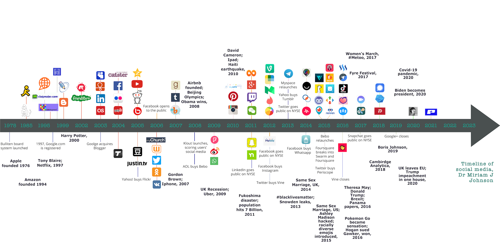

# VI Social Networks

On Social media platforms, apps and services Dr. Miriam J. Johnson provided some comprehensive timeline on her website to visual the order of development.

<figure><figcaption></figcaption></figure>

**Source:** [https://www.booksaresocial.com/timeline-of-social-media-with-added-world-events/](https://www.booksaresocial.com/timeline-of-social-media-with-added-world-events/)

Further develpoments can be discovered here: https://explodingtopics.com/blog/new-social-media-networks

**VI.I HomePage-Blog (1989\[2]) vs. MySpace (2003)**

**Kontext:**

Zu Beginn des Internets stand der persönliche Zugang und das eigene verbreiten von Informationen im Vordergrund. Durch neue Techeniken, wie HTML und CSS und öffentlich zugängliche Webserver entwickelte sich in den 1990er Jahren der Trend zu persönlichen Websiten für Unternehmen oder die eigenen Hobbys (Homepages). Diese setzten allerdings immernoch größere technische Kentnisse voraus. Zunehmend wurde die Veröffentlichung von Websiten durch Contentsysteme (Wordpress, Drupal) und Bloganbieter (tumblr etc…) vereinfacht und einer größeren Menge an Menschen verfügbar gemacht. In den 2010er Jahren folgte mit dem Wachstum von Facebook eine weitgehende Verdrängung von Blogs und Homepages.

**VI.II MySpace (2003) vs Facebook (2004)**

...

**VI.III Facebook (2004) vs. Twitter (2008)**

...

**VI.IV Facebook (2004) vs. Tumblr (2007)**

...

**VI.V Twitter (2006) vs. Instagram (2010)**

**VI.VI Instagram (2010) vs. Google+† (2011)**

...

**VI.VII Instagram (2010) vs. TikTok (2014)**

...

**VI.VIII TikTok (2014) vs. BeReal (2020)**

...

**VI.IX TikTok (2014) vs. Clubhouse (2020)**

...
