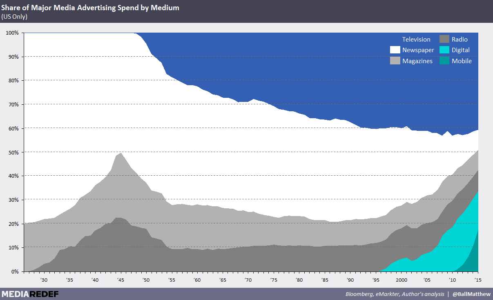
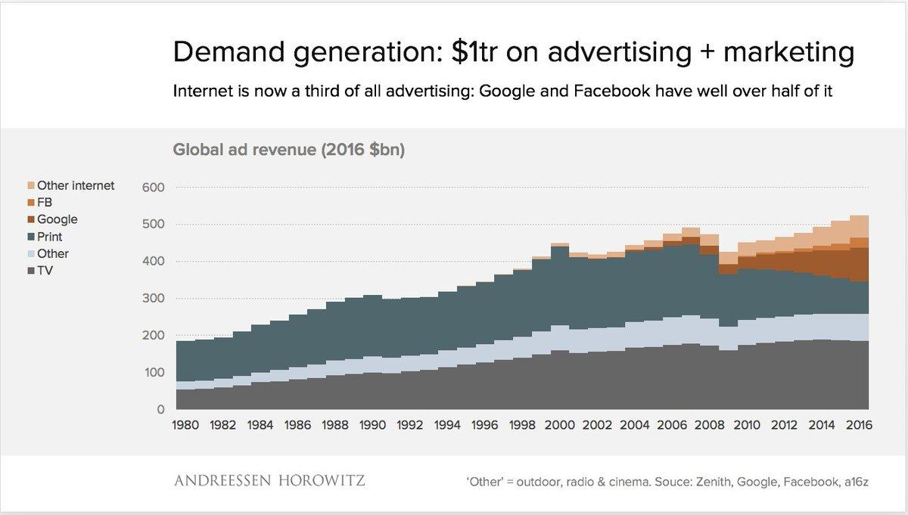
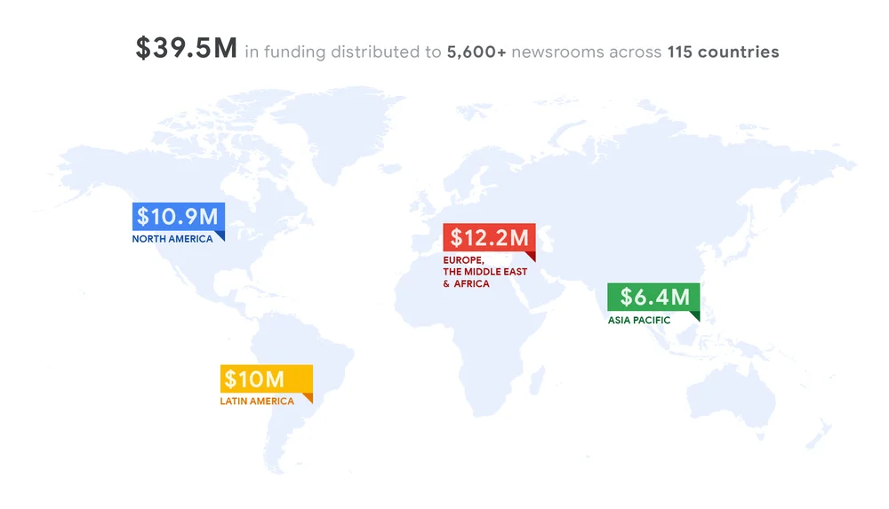
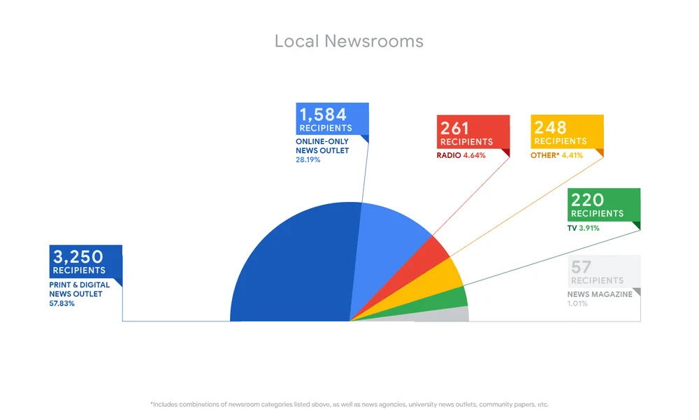
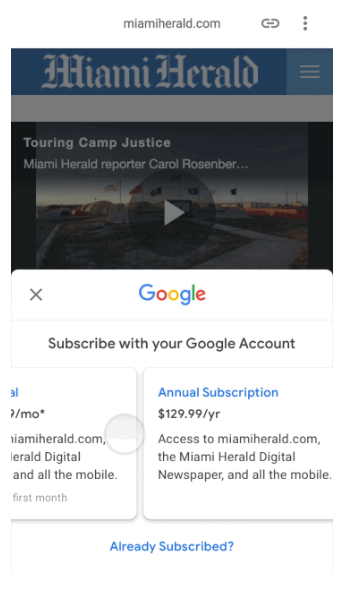
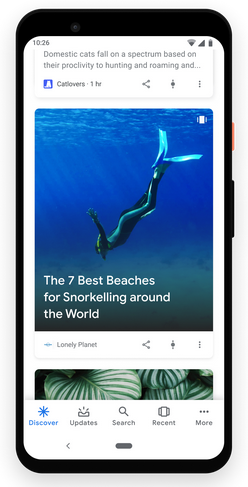

# I Information retrival

Also see: [https://en.wikipedia.org/wiki/Timeline\_of\_web\_search\_engines](https://en.wikipedia.org/wiki/Timeline\_of\_web\_search\_engines)

[https://www.thehistoryofseo.com/The-Industry/Short\_History\_of\_Early\_Search\_Engines.aspx](https://www.thehistoryofseo.com/The-Industry/Short\_History\_of\_Early\_Search\_Engines.aspx)

[https://www.hpe.com/us/en/insights/articles/how-search-worked-before-google-1703.html](https://www.hpe.com/us/en/insights/articles/how-search-worked-before-google-1703.html)

**I.I Indexsuche (< 1993\[1]) vs. Yahoo (1994)**

Yahoo company spreading his portfolio and technologies heavely by acquisations. The senior VP listed all the acquisations since and argued, that Yahoo needs to use its own ressources better. The following is a blog post that sum ups the acquisations since 1997

**Net Controls Corporatio**n was Yahoo!’s first major acquisition. Net Controls Corporation developed software that was the basis of the My Yahoo! Ticker. The premise of Net Controls’ product was to provide a customized stock, sports, and weather ticker in the Microsoft Windows operating systems taskbar.

Yahoo!’s purchase of Four11 for $92 million has now evolved into Yahoo! People Search. Yahoo! People Search seems to have remained the same since the purchase as its only functions are to search people by their first and last name, address, e-mail address, and phone number.

**The acquisition of ClassicGames.com** brought Yahoo! into the realm of online gaming. Yahoo! Games which was partially powered by ClassicGames.com is now a place for users to download all types games for about $19.99 per game. [Back then](http://web.archive.org/web/19980109120448/http://classicgames.com/%22%20/t%20%22\_blank), ClassicGames.com was a website where users could play a few select Java-based multiplayer games such as Hearts, Spades, and Euchre. To see another move Yahoo! made to penetrate the massive gaming market, also look into the acquisition of The All Seeing Eye below.

**Yahoo acquired GeoCities: Ah yes, GeoCities.** I would call GeoCities the “MySpace” of the 90s. GeoCities is still alive and running on Yahoo! and is a free homepage builder that costs up to $8.95 per month for premium services. Geocities was Yahoo’s first acquisition billion dollar plus acquisition.

**GeoCities** was founded by David Bohnett and John Rezner in 1994. Before GeoCities was acquired and revamped GeoCities, communities were heavily advocated. Users selected a “city” to group their webpages with a certain clique. These cities were related to the website content that the user was planning on focusing upon. For example, entertainment websites were “Hollywood” and computer-related websites were “SiliconValley.”

GeoCities started as BHI or “Beverly Hills Internet” at www.bhi90210.com and was a small web hosting company in southern California. GeoCities quickly popularized and was signing thousands of “Homesteaders” per day. On May 1997, GeoCities started the allowing of advetisements and many users revolted, but since the Internet was becoming a global commodity and because GeoCities was a free service, it still remained popular.

However, in June 1998, GeoCities introduced watermark advertisements on every website hosted by GeoCities, which ultimately costed them many users (including myself). Watermarked advertisements when a floating image hovered on the right side of the page on every website and followed the page as you scrolled up and down. I found myself switching to TheGlobe.com to practice website design after GeoCities introduced the watermark ads.

In August 1998, GeoCities had an IPO with a listing on NASDAQ with the code, GCTY. The initial price was $17 and rose to even $100 at one point on the first day. Four months later, Yahoo! purchased GeoCities for $3.57 billion. There was another major drop in users after Yahoo! modified the terms of service on GeoCities stating that Yahoo! would own the property placed on GeoCities pages including media such as images, but Yahoo! had quickly reversed this TOS decision after more and more people revolted.

And furtther more...

**Summary:**

\- Yahoo acquired companies that fill the criteria of beeing popular at this time (like Geocities) or had an innovative way of reaching the user (Net Controls Corp).

\- Only a small part of the technology mad ein the final Yahoo plattform, so the technolgies of the companies were rather not used, or unnecessary bought.

_Source: s. \[InVsY.1]_ https://pulse2.com/the-current-state-of-yahoo-and-where-yahoos-acquisitions-since-1997-are-now/, _retrieved on 17.05.2023_

**-** In January 1994, Yang and Filo were electrical engineering graduate students at [Stanford University](https://en.wikipedia.org/wiki/Stanford\_University), when they created a website named "Jerry and David's guide to the World Wide Web".[\[9\]](https://en.wikipedia.org/wiki/Yahoo!%22%20/l%20%22cite\_note-9)[\[10\]](https://en.wikipedia.org/wiki/Yahoo!%22%20/l%20%22cite\_note-How\_Jerry-10)[\[11\]](https://en.wikipedia.org/wiki/Yahoo!%22%20/l%20%22cite\_note-11)[\[12\]](https://en.wikipedia.org/wiki/Yahoo!%22%20/l%20%22cite\_note-12)

\- The site was a human-edited [web directory](https://en.wikipedia.org/wiki/Web\_directory), organized in a hierarchy, as opposed to a searchable index of pages. In March 1994, "Jerry and David's Guide to the World Wide Web" was renamed "Yahoo!" and became known as the [Yahoo Directory](https://en.wikipedia.org/wiki/Yahoo!\_Directory)

\- Yahoo was incorporated on March 2, 1995. In 1995, a [search engine](https://en.wikipedia.org/wiki/Search\_engine) function, called Yahoo Search, was introduced. This allowed users to search Yahoo Directory.[\[22\]](https://en.wikipedia.org/wiki/Yahoo!%22%20/l%20%22cite\_note-22)[\[23\]](https://en.wikipedia.org/wiki/Yahoo!%22%20/l%20%22cite\_note-23) Yahoo soon became the first popular online directory and search engine on the [World Wide Web](https://en.wikipedia.org/wiki/World\_Wide\_Web).[\[24\]](https://en.wikipedia.org/wiki/Yahoo!%22%20/l%20%22cite\_note-24)

\- By 1998, Yahoo was the most popular starting point for web users,[\[27\]](https://en.wikipedia.org/wiki/Yahoo!%22%20/l%20%22cite\_note-27) and the human-edited Yahoo Directory the most popular search engine,[\[15\]](https://en.wikipedia.org/wiki/Yahoo!%22%20/l%20%22cite\_note-Directory-15) receiving 95 million page views per day, triple that of rival Excite.[\[25\]](https://en.wikipedia.org/wiki/Yahoo!%22%20/l%20%22cite\_note-auto-25) It also made many high-profile acquisitions.

**Summary:**

\- Yahoo used a mixture of human editet search catalog and a textual interface to lookup the catalogue

\- It was founded by university students

\- Yahoo grew to the most popular search engine until the year 1998

_Source: s. \[InVsY.2] Source: s. \[InVsY.2] https://en.wikipedia.org/wiki/Yahoo!, retrieved on 17.05.2023_

**-** October 10, 1996 -- Yahoo!, the world's most popular online guide to the Internet, today launches Yahoo! Germany, a localized German version in the local language

**-** now comprises a classification of more than 400,000 sites on the World Wide Web. Yahoo! is a leader in terms of traffic, receiving an average 14 million page views per day as of September 1996.

\- German version of Yahoo! will provide seamless access to the full directory listings of main Yahoo!, making it the first navigational site to provide a comprehensive listing of German sites and the rest of the WWW. Yahoo! Germany will list all German web sites first plus full access to relevant worldwide sites.

\- Yahoo! Germany will also carry services targeted to the needs of a German audience. Yahoo! Germany will be the only web site in Germany to provide headline news and full-text from Reuters, via German newsfeeds in business, sports and general news. The popular "What's New", "What's Cool" and "Random" features of Yahoo! Germany will be created by a local editorial team. More value-added services are set to follow.

\- Yahoo! Germany introduces a proven advertising platform for the German market. The new site is launching with German consumer and technology advertisers on board (…)

\- Users of Yahoo! Germany will also be able to access Yahoo!'s fully integrated Web-wide searching capabilities provided by Alta Vista. Searching and browsing features on Yahoo! are integrated to allow the user to choose the most appropriate navigational methods at any point during the quest for information. Web users of all skill levels can easily navigate through Yahoo!'s hierarchical index, which gives access to the largest database of >web sites catalogued by people.

**Summary:**

\- Yahoo adapted its services to other cultures and countries, by using integrating local organisations and companies into their service. Also the build team sof loca editors to deliver valueable news.

\- Yahoo Germnay managed to publish the first news service from Reuters to their customers in Germany.

\- Yahho Germany not only provide local sites, but also whole catalogue for the world wide web.

_Source: s. \[InVsY.3] https://web.archive.org/web/20080331063248/http://yhoo.client.shareholder.com/press/ReleaseDetail.cfm?ReleaseID=173399, retrieved on 17.05.2023_

.png>)

\- Yahoo Directory \[was a] (...) hand-compiled list of websites, organized into topics. Now, the venerable Yahoo Directory is closing.

**-** When Yahoo began in 1994, the most common way people found websites was to browse through lists, where sites were often organized into topics.

\- Founders Jerry Yang and David Filo quickly realized their own list needed a better name than “Jerry and David’s Guide to the World Wide Web.” They settled on Yahoo! (with exclamation mark). That stood for “Yet Another Hierarchical Officious Oracle” — a reference to organizing sites in a hierarchical order.

\- A “directory” relies on humans to review websites, summarize them with short descriptions and organize them into a categories. When Yahoo started, this **system was effective,** because there weren’t that many pages on the web (relatively speaking) and automated search technology to organize websites wasn’t very good.

\- \[This organisation of information] contributed in a big way Yahoo’s popularity over traditional search engines like InfoSeek or Excite that used automation. **Yahoo had better relevance.** You could find what you were looking for.

\- Yahoo was so popular that publishers had real worries about getting included. From around 1996-1999, there were long delays to list new sites. Sites that did get in could find they were effectively invisible because a Yahoo editor might have changed their descriptions in a way that didn’t include important keywords.

**Conclusion:**

\- Yahoo was first an human sorted and hierachical structured website dictionary and later develped into an interface for an search service based on that dictionary.

\- It provided a surplus to many users because it provided relevant results. This was possible, because the amount of websites was not so high and it could be easy structured and sorted by humans.

_Source: s. \[InVsY.4] https://searchengineland.com/yahoo-directory-close-204370, retrieved on 17.05.2023_

\- If you needed to search for someone's telephone number, your primary tool was the telephone book, sometimes referred to as a telephone directory. The white pages listed people's name alphabetically. The yellow pages listed businesses by category. Advertising in the yellow pages was a primary tool many people used when searching for a business in the days of telephones.

\- WWW was introduced in 1990 and till that time all the website were privatized and so information was passed manually with no search required.

\- W3Catalog was the first one to be called as primitive search engine which had a web robot to index the files and make it faster and scalable.

\- With introduction of WWW. Then came the need to know the web pages out there in world introduced by someone you don't know. So in late 1990 first web search tool was born named [Archie](http://en.wikipedia.org/wiki/Archie\_search\_engine%22%20/t%20%22\_blank) . It got it's name for resembling Archive and so Archie without a "V". not sure what was the problem with "V" though. This tool use to download the whole webpage DNS via FTP and search on it. The worst part was that reference were non indexed . So in short was very crude and not scalable at all.

**Conclusion:**

\- Categorizing information in dictionaries was an traditional way of dealign with lot of amount of information. Telephone books listed companies by types.

\- When the public web developed this concept was transferred an lead to the creation of tools like Gopher or Yahoo

\- A further development was the automation of finding and indexing websites by their name and text content, that lead finally to the development of google.

_Source: s. \[InVsY.5] https://www.quora.com/How-did-people-search-on-the-web-before-search-engines-were-created, retrieved on 17.05.2023_

**-** The core idea behind any search engine is information retrieval based on a user’s query.

**-** Internet owes its origin to the development of ARPANET in 1969, but search engines came almost two decades later in the 90s. Prior to this people only shared website links and names directly and through word to mouth publicity.

\- **1990:** The first search engine, **Archie** appeared. Archie indexed public files available for download from sites that used FTP (file transfer protocol). Due to limited space, they did not index the content for sites and only provided their directory listings.

**- 1991:** With the rise of Gopher protocol, two new search engines emerge: **Veronica** and **Jughead** (which are characters from the comic series, Archies!), which index file names and titles stored in Gopher index systems.

**- 1993:** The first known web crawler, **World Wide Web Wanderer**, was developed, that measured the growth of the internet and stored it in the Wandex database.

The first web-based search engines: **W3Catalog** and **Aliweb** are released. They did not use web crawlers and were dependent on a list of websites.

By the end of the year, the first web search engine to use crawling and indexing to display search results, **JumpStation** was released.

\- **1994: Yahoo** is born! Created by David Filo and Jerry Yang, it became the first popular web directory. It relied on humans to provide short descriptions for each URL and organize them into categories.

\- James Cordata says that we have now developed an index-based approach when browsing information, similar to looking for keywords at the end of a book and going to the specific pages instead of going to the table of contents and then following up on the information. The latter offers information in a much more structured way, and we end up knowing a lot more than what we were actually looking for. → Information are more substructured

**Conclusion:** At the beginning websites got shared via talking in private group. As soon websites became public available via the DNS systems people started to organize the access to them. First they created Indexing tools and protocols that could index file names and paths, later extended it to content. The next development was the autoamtic discovery of new sites opposing to the manual registration of sites.

_Source: s. \[InVsY.6] https://ayushj.substack.com/p/the-evolution-of-search-past-present, retrieved on 17.05.2023_

**I.II Yahoo (1994) vs. Google (1998)**

Relevanz: _„As of Jan. 2020, Google owned 87.4% of the global market share of search engines“_

\- Google veröffentlicht Prototypen eines Produktes und überarbeitet es durch den Einsatz der gewonnen Daten kontinuierlich. Nach dem Start wurden die Suchalgorithmen kontinuierlich verbessert und zog so mehr Leute an.

\- Googles erstes Geschäftsmodell war eine Suchmaschine, die Menschen half über Algorithmen die Übersicht über eine riesige Menge an Daten zu erhalten und genaue Suchergebnisse lieferte.

Früher mussten sich Menschen mit dem Sortieren der Informationen beschäftigen. Googles Algorithmen bewerten den Inhalt zu einem Suchwort automatisch.

Dabei wurden zunächst neue Techniken, wie eingehende Links, als Vertrauensmechanismus, Suchworthäufigkeit und Seitentitel einbezogen.

_„Using this scoring approach, Google was able to serve up more accurate results than many of the_ [_existing search engines_](https://www.investopedia.com/articles/investing/071515/search-engines-compete-google.asp) _that preceded it in the market.“_

\- Google konnte durch einen wirtschaftlichen Aufschwung und großer Vertrauen in die Techszene in den 2000er Jahren als Startup schnell Investorengeld einwerben (Dotcom Blase).

Nach dem Ende der Blase wurde von Investoren als garant für ihre Investion ein profitables Geschäftsmodell erwartet. Google entwickelte ein Geschäftsmodell auf der Basis der Online-Plattform Adwords. Durch Adwords führt Google Werbetreibende und Nutzer zusammen. Das Unternehmen kann pro Klick verdienen.

Google erschuf eine Plattform, die relevante Anzeigen für Werbetreibende anbietet.

Adword / Adsense generiert heute automatische Einnahmen für das Unternehmen

\- Das Unternehmen besitzt weitere attraktive Dienste wie YouTube, Maps, Google Apps und Google Cloud. Die Plattformen erreichen größe Nutzergruppen und bieten mehr digitalen Werbeplatz. Auch diese Dienste starteten oft kostenlos und wurden dann iterativ verbessert, sowie durch Werbung monetarisiert.

**Fazit:** Google hat zwei Kernkomponenten. Die eine ist eine Suchmaschine, die von den meisten Menschen auf der Welt bevorzugt wird (Google Suchpage). Die zweite ist ein Selbstbedienungs-Werbenetzwerk, das Einnahmen aus dieser Suchmaschine und den vielen digitalen Assets generiert, die Google besitzt. (AdSense). Mittlerweile erstrecken sich die Dienstleistungen auf Webseiteanalyse (Google Analytics), Navigation (Maps), ein Betriebssystem (Android) welches den Browser (Chrome) mit google als standardsuchmaschine installiert hat, ein Anruf, Kalender, Mail, Office, Cloud-Speicher und AR-Dienst. Kürzlich versuchte es Google auch mit Gaming.

Die Menschen setzen Google ein, um den Zugang zu der massiven Menge an Informationen im Internet zu erhalten und daraus die relevanten auszuwählen. Google übernimmt die Katalogisierung (Crawling), die Auswahl der relevanten Informationen im Kontext einer Suchanfrage (Relevanzabschätzung ?) und die Bereitstellung der Information über die Auslieferung von URLs oder generierten Texten (ab 2021 ?). Dadurch bietet Google als „Interface“ zum Internet den Nutzer einen großen Mehrwert in Form von Zeit und niedrigerem „Mental Load“.

_Source: Gedankenprotokoll_

**Fazit:** Google hat einen Wettbewerbsvorteil, da es möglichst relevante Ergebnisse liefert. Mittlerweile wird die Relevanz durch Algorithmen bestimmt, die basierend auch vorherige Suchergebnisse und einem Nutzerprofil (Siehe Werbe-ID oder Google-Account) die relevantesten Seiten als erstes im Suchfeld anzeigen. Google gewinnt dafür die Daten aus der Interaktion seiner Nutzer mit den diversen Google-Diensten. Zusätzlich binden viele Webentwickler freiwillig das Skript „Google Analytics“ ein, welches Google Webseite übergreifendes Tracking ermöglicht.

Die s. „Dead Internet Theory“ gehen davon aus, dass sich die Seiten aktiver Webseiten durch Google drastisch reduziert haben.

Enrico Tarttori stellt in seinem Video von YouTube „What happened to Google search ?“ fest, dass sich eine fast ausschließliche kommerzielle Platzierung der von google vorgeschlagenen relevantesten Suchergebnisse auf der 1. Seite ergibt.

_Source: s. \[G.1]_ [_https://www.investopedia.com/articles/personal-finance/042415/story-behind-googles-success.asp_](https://www.investopedia.com/articles/personal-finance/042415/story-behind-googles-success.asp)_, retrieved on 15.01.2023_

Kontext der Zitate: Yahoo war voller Links und Bilder und lädt langsam mit 16kb Leitung. Google war leichtgewichtig designt

_„In a nutshell, Google is successful because it creates products that solve problems and create tremendous value for its users._

Products that deliver a great user experience and improve people's lives tend to become habit forming. As a result, Google has become the first choice for for hundreds of millions (even billions for some products) for search, email, maps and many other services that people use daily.From a business perspective, Google has been enormously successful because of its ability to monetize search through AdWords. This has made it possible for Google to create many more successful products and services._“_

_„_No wonder this really made all of those early internet users switch to Google forgetting everything else. So If you ask me what's the single reason behind Google's success - its SIMPLICITY_**“**_

**Fazit:** Google war den Konkurrenten zu seiner Zeit auch technisch überlegen, unter damaligen Voraussetzungen bot es geringere Ladezeiten und ein leichter verständliches UserInterface. Google schaffte es nur das nötigste für seine Aufgabe dem Nutzer anzubieten, die Aufgabe aber außergewöhnlich gut zu erfüllen.

_Source: s. \[G.2]_ [_https://www.quora.com/How-did-Google-become-a-big-company_](https://www.quora.com/How-did-Google-become-a-big-company)_, retrieved on 15.01.2023_

**I.III Google (1998) vs. MSN Search (1999)**

**...**

**Fazit:**

_..._

1. 1993 the first web search engine with crawling, searching and indexing were published ↑

**I.IV Zeitungen (1650\[1]) vs. Google News (2002)**

\- This article tells the story of advertising revenues at the rise of internet

.png>)- First, it’s important to note that newspaper advertising revenue peaked a few years before the rise of Google (and many years before Facebook).

\- print newspapers had a monopoly on local information distribution due to the prevailing technologies of their time. These regional monopolies were slowly eroded by the introduction, first, of radio and then **television** (see [Lorain Journal Co. v. United States](https://en.wikipedia.org/wiki/Lorain\_Journal\_Co.\_v.\_United\_States)). But, ultimately, newspapers were disrupted by the internet (2000er)

- newspaper had a monopoly, becuase of high fixed costs (priting press etc) and low scale / margin costs (paper / ink) (→ Technology with high access border)

\- Therefore, it was very easy for newspapers to dominate the local market with one bundled product, which included everything from political news and opinion to sports and classifieds. The monopoly profits were used to fund, among other things, investigative journalism (which would lose money as a standalone business but provides value and prestige as part of a bundle).

\- On pulishing in the internet you dont need printing press / trucks → newspaper was **unbundled** by many internet companies, large and small. Local advertising does googel, commentary can be done on twitter, news on facebook and twitter

\- Google and Facebook entered the ad market with more efficient self-service platforms for advertisers and quickly gained market share. (Decreasing border for advertisers)

\- 2004 to 2014, Google spent at least $23 billion buying 145 companies, facebook 66

\- In other words, Google is not dominant in search today because it engaged in killer acquisitions of rival search engines. Of the 66 Facebook acquisitions, only Instagram is a plausible case of horizontal integration between social media companies (and, even then, Facebook invested heavily post-acquisition).

\- Google and Facbook have no monopoly at advertising revenue in 2016

\- even if we break up all the big tech companies, your local newspaper will not magically have a profitable ad business again.

\- The system changed now newspaper needs new buisness model which cant be secured by protectionism

\- „new media landscape and the growing competition for advertising dollars, make it harder for a weak newspaper to survive, and make its survival less urgent,“

\- Resurrecting the regional monopolies once enjoyed by local newspapers is both undesirable and unrealistic

\- Comment: „There are only a few viable print options now that many have either merged or collapsed. What has followed is a similar result, and the reduced competition and greater need for larger margins means less investigative and less interesting news. There are fewer reasons to consume any of the local „“media options.“

\- Comment: Who has time for print media? This site is a perfect example… it’s focussed on a few topics that I am interested in, I check it fairly regularly. Amazon and Google can help me research something I want to buy, or may someday want to buy, or likely will never buy but am curious about.

The one thing I worry about is **attention span**. By consuming my attention reading single-page items instead of in-depth material, is that affecting how I think in other ways ?

**Fazit:**

\- Der Artikel geht auf den engen Zusammenhang zwischen Werbeeinnahmen, Auflage und Größe von medien ein.

\- Der Autor argumentiert, dass die Zeitungsverleger über die Technologie der Presse und später der Drucker ein Monopol besaßen (hohe Startinvestition und hochskalierbar), dass Ihnen half gebündelte Produkte (Zeitung) zu verschiedenen Themen zu verkaufen und durch die erzeugte Aufmerksamkeit Werbekunden zu bekommen

\- Für den Autor leutete der Technologiewechsel – erst zu Radio später zu Fernsehen, dann zum WWW den Fall dieser lokalen Medienmonopole ein. Laut dem Diagramm „Newspaper Revenue Advertising“ erreichten die Werbeeinnahemn der Zeitungsgesellschaft dort ihren historischen Höhepunkt. Danach wurden sie schnell durch das aufkommende Internet und fortschreitend durch die Dienste von Google und Facebook zurückgedrängt

\- Digitale Dienste, wie Google news sind wetterbewerbsfähiger: Sie senken die Eintrittschwelle, verteilen Informationen gezielter, da sie suchbar sind und das bundel auflösen und verteilen Informationen exterm schnell. Darüber generieren sie mehr Leser als traditionelle Zeitungen.

\- Facebook und Google haben mit dem Aufkauf anderer Firmen den Verdacht auf konkurenzschädigendes Verhalten gemacht. Allerdings korrellieren die Werbeeinanhemn nicht mit der Summe die für den Aufkauf von Konkurrenten ausgegeben bei Google und Facebook. Auch wurden meist fachfremde Firmen aufgekauft.

\- Ein Leser merkt an, dass das auflösen des Bundels und das Ausliefern immer kleinerer Informationshäppchen unser Denken als Gesellschaft kritisch verändern könnte (weniger Gedankenkomplexität)

_Quelle: \[NWP.1] s._ [_https://www.techdirt.com/2019/10/25/google-facebook-didnt-kill-newspapers-internet-did/_](https://www.techdirt.com/2019/10/25/google-facebook-didnt-kill-newspapers-internet-did/)

The articles describes the fall of print media connected with the rise of social media avertisment.

„crisis of the free press and democracy: Advertising revenue that used to go to quality journalism is now captured by big tech intermediaries“

„Advertising revenue for print newspapers has fallen by two-thirds since 2006. From 2008 to 2018, the number of newspaper reporters [dropped 47 percent](https://www.pewresearch.org/fact-tank/2019/07/09/u-s-newsroom-employment-has-dropped-by-a-quarter-since-2008/%22%20/t%20%22\_blank). „

„cultural barriers meant to guard against distorting effects of advertising have broken down“

“conflicted communications.: see communication over search engines like Page an Brin saw it.

\- „Richard John [argues](https://www.hup.harvard.edu/catalog.php?isbn=9780674088139%22%20\t%20%22\_blank), for roughly 200 years (beginning with the [creation of the Post Office in 1791](https://www.amazon.com/Spreading-News-American-Postal-Franklin/dp/0674833422%22%20/t%20%22\_blank)), American policymakers generally sought to decentralize media power and keep communication networks neutral.“

\- late 1970s: elaxed antitrust law, eliminated the fairness doctrine

\- „allowed the creation of large media conglomerates through the [Telecommunications Act of 1996](https://www.fcc.gov/general/telecommunications-act-1996%22%20/t%20%22\_blank).“

\- „Google spent at least $23 billion [buying 145 companies](https://www.cnbc.com/2014/08/19/googles-best-and-worst-acquisitions.html%22%20/t%20%22\_blank), including the advertising giant DoubleClick.“

\- „when The Wall Street Journal refused to abide by Google’s formatting terms, Google removed it from its search ranks and the newspaper’s traffic [dropped](https://www.bloomberg.com/news/articles/2017-06-05/wsj-ends-google-users-free-ride-then-fades-in-search-results%22%20/t%20%22\_blank) by 44 percent.“

\- „Google and Facebook grew to control important information utilities, like general search, social networking and mapping. New forms of advertising — underpinned by unregulated use of data and sold through opaque and complex auctions — then undermined the bargaining leverage of publishers and enabled new forms of fraud using bots and falsified content.“

**- „radical centralization of power over the flow of information“**

\- „Advertising financing presents an inherent conflict of interest because advertising is a third party paying to manipulate someone. In traditional media, advertising can influence editorial choices“ (Comment: of Media, it manipulates the search filter)

\- „Consequently, the manifestation of the distorting effect of advertising — addiction, manipulation, fraud, tearing of a collective social fabric — has been met with little cultural immunity, policy response or institutional defenses.“

\- ethical control over advertising: signalling effects of news brands, diversity of new outlets, seperation of advertisment and editorial, groups to protect journalists from company influence

\- „Sergey Brin and Larry Page (Google) — [noted this problem](http://infolab.stanford.edu/\~backrub/google.html%22%20/t%20%22\_blank). They looked at the problematic search engine market of the 1990s — with companies offering advertisers the chance to pay to be listed as an organic search result — and argued that financing a search engine business through advertising was fundamentally corrupting.“ (Comment: But they decided against it, when the dotcom bubble bursted to preserve their company...)

\- Search engines would: „also have an incentive to self-deal, putting content in front of users that benefits the utility rather than the end user. And they would have an incentive to surveil their users, so that they could target them more effectively.“

\- „The task of policymakers is now to put together the ethical structures to mitigate these conflicts.“

\=> Two problems: concentration of power and ethical biased acting of search engines

**Fazit:**

\- Der Artikel erwähnt, dass die großen Zeitungsmonopole in den USA durch den Telecommunications Act 1996 begünstigt wurden, und sich gegen einen dezentralisierten Trend wendeten

\- Google gelang es die Kontrolle über den Infromationsfluss nach 2000 zu gewinnen, sie konnten diese Macht einsetzen um die Arbeit der Zeitungen zu beeinflussen. Für das Walls Street Journal führte eine Weigerung Googles Formatierungsvorschriften einzuhalten zu einem Bescuherminus von 44 %, nach dem die Zeitung nicht mehr bei Google gelistet wurde.

\- Google hat Monopolartige macht über die Informationen im Internet, dieses Monopol ist stärker als die damaligen Mediakonglomerate

\- Mit diesem Monopol treten eine Reihe von Risiken auf:

Internetspezifisch: Verbreitung von Falschanchrichten (jeder kann produzieren) und Bots (jeder kann automatsieren)

Zielkonflikte: Werbefinanziertes Modell, Anzeigen beeinflussen das Verhalten der Nutzer und die Auswahl der gezeigten Medien (Google Suchergebnisse), Journalisten, die Content für Werbung liefern können besser bezahlt werden.

→ Psychologische Effekte: Glaubwürdikeit für Leser könnte sinken (Signaling effect), Breite der angebotenen Artikel könnte sinken (?)

**Kommentar: Was ist mit signaling effects of brands gemeint ?**

**What is the signaling effect of new brands in online newspaper and why is there an debate about it going on ? (Chat-Gpt 3.5 erzeugt am 08.04.2023)**

The signaling effect of new brands in online newspapers refers to the **impact that the presence of new brands has on the perceived quality and credibility of the news website.** In other words, the introduction of a new brand can signal to readers that the website is expanding its coverage and improving the quality of its content.

There is a debate about the signaling effect of new brands in online newspapers because some argue that the presence of multiple brands on a website can dilute the overall credibility of the website, while others argue that it can enhance the website's credibility by signaling growth and diversity in its coverage.

On one hand, those who argue against the use of multiple brands suggest that readers may view the introduction of new brands as a sign that the website is sacrificing quality in order to increase its reach. They suggest that the use of multiple brands can lead to confusion and skepticism among readers about the credibility and consistency of the website's content.

On the other hand, those who argue in favor of using multiple brands suggest that it can signal to readers that the website is expanding its coverage and exploring new areas of interest. They suggest that it can enhance the website's credibility by signaling growth and diversity in its coverage.

Overall, the debate about the signaling effect of new brands in online newspapers highlights the importance of carefully considering the impact that branding decisions can have on the perceived quality and credibility of news websites.

_Quelle: \[NWP.2] s._ [https://www.nytimes.com/2019/10/17/opinion/tech-monopoly-democracy-journalism.html](https://www.nytimes.com/2019/10/17/opinion/tech-monopoly-democracy-journalism.html)

\- „Through both our services and our direct funding of news organizations, Google is one of the world’s biggest financial supporters of journalism.“ „We've shown that commitment over decades of financial support by providing billions of dollars — sharing revenue with news publishers via our ad network, developing tools, training and funding through programs like the Google News Initiative, and launching Google News Showcase.“

\- Googles sees participation to publish on Google News as a free choice. Website oweners can decide if they want to get linked in Google or not and if there are preview snippets are generated about their websites. They can choose between multiple content forms that is displayed as text snippet: no, max char number of snippet, maximum seconfds of a video in a snippet, max image resolution of an snippet, exclude an exact html-div

Since 2019 (?) Gogoles generates text and image snippets as first result, if the websites markup their website with structured data. Google introduced this, because contetn creators argumented google redirecting the traffic to their content to the google website.

See: [https://webmasters.googleblog.com/2019/09/more-controls-on-search.html](https://webmasters.googleblog.com/2019/09/more-controls-on-search.html) , accessed on 08.04.2023

\- Google on advertisment revenue in news: „We don’t show ads — or make money — on the vast majority of searches. And we don’t run ads on Google News or the news results tab on Google Search.“

Comment: That true, but most user reach to google news via a clasic google search. At this searches ads are shown.

_- „_Each month, people click through from Google Search and Google News results to publishers' websites [more than 24 billion times](https://blog.google/outreach-initiatives/google-news-initiative/setting-record-straight-news/%22%20/t%20%22\_blank). The traffic we send to news sites helps publishers increase their readership, build trust with readers and earn money._“_ „Each month, people click through from Google Search and Google News results to publishers' websites [more than 24 billion times](https://blog.google/outreach-initiatives/google-news-initiative/setting-record-straight-news/%22%20/t%20%22\_blank) — that’s over 9,000 clicks per second.“

\- Google on their buisness model: _„_And the internet, while providing cheaper distribution and more potential readers, completely changed the business models of news organizations, with classifieds revenue moving to [specialized online classified services](https://blog.google/around-the-globe/google-asia/australia/de-classified-what-really-happened-newspapers/%22%20/t%20%22\_blank) and increased competition from a wider range of publications._“_

\
_Google News Initiative:_

\- „The GNI works directly with news organizations of all sizes on developing new products, programs and partnerships to help news publishers grow their business. It includes a $300 million funding commitment to news organizations.“

\- GNI Digital Growth Program:

GNI Workshops: „We’ve provided training for over 400,000 journalists on skills including digital verification, data visualization, and machine learning through in-person trainings. And journalists have visited the GNI Training Center more than 1.7 million times to access free online courses.“ „Topics: Reader Revenue, Audience Development, Advertising Revenue, Data and Product. Our curriculum includes playbooks full of real-world examples, interactive exercises to help solve business problems, workshops to bring these lessons to life and Labs to provide hands-on advisory support“

They provide it as„workshops, playbook, interactive execises with google tools on goal setting, user funnel and scaling, one tone coaching with google labs“

\- GNI Emergency Relif Fund (JERF): Availabel while covid from April 2020. „In the last few months, we have provided $39.5 million in funding to more than 5600 publishers in 115 countries. The money is being applied in diverse and creative ways, from ensuring basic reporting needs and giving emergency stipends to allow reporters to cover the crisis, to driving audience engagement and generating subscriptions.

“

Source: [https://blog.google/outreach-initiatives/google-news-initiative/journalism-emergency-relief-fund-data/](https://blog.google/outreach-initiatives/google-news-initiative/journalism-emergency-relief-fund-data/), accesed on 08.04.2023

„We learned from publishers that advertising continues to be the sole source of revenue for most JERF recipients, with 50 percent claiming to be totally advertising dependent. A survey we carried out also showed that less than 30 percent of recipients operate some form of a paywall, while less than 18 percent rely on community contributions or memberships to support their journalism. That situation is changing, though, with 60 percent of the recipients planning to diversify their revenue streams by developing subscription, membership or contribution models. “

\- GNI digital tools:

→ Developing of new service like Google Subscription.

_GNI Initiative Innocation Challenge:_

„The [GNI Innovation Challenge](https://newsinitiative.withgoogle.com/info/innovation-challenges/%22%20/t%20%22\_blank) is a global program that empowers news organizations from around the world to demonstrate new thinking in digital journalism. We’re on the lookout for great ideas. Do you want to launch a new news product? Have a never-tested-before approach to increase quality in journalism? Or do you want to find a new way to diversify your revenue? We’re looking for news innovators who want to challenge the status quo and take bold steps towards a more diverse and sustainable future. It follows the first two rounds which saw [41 projects](https://newsinitiative.withgoogle.com/info/innovation-challenges/funding/%22%20/t%20%22\_blank) selected from 15 countries. The projects will also produce lessons and new ways of thinking to share with the wider industry._“_

„We encourage innovative projects - focused on, but not limited to - the areas below:

* Ways to increase reader engagement and/ or reader revenue
* Developing and diversifying business models
* Business intelligence approaches to better leverage data capabilities
* New methods of distribution
* Combating misinformation
* Increasing trust in journalism
* Reaching new audiences
* Improving the efficiency of workflows
* Exploring new technologies“

„Google will fund up **to $250,000 for** selected projects but we strongly encourage consistency regarding the funding request. The amount requested should reflect the scope of the project and all approaches are welcomed from small prototypes to test new things to more transformative and at scale implementations. Out of the total project budget, **Google will finance up to 70% while the remaining at least 30% must be provided by the applicant.“**

_Further programs:_ News Lab, Google News Initiative Lab, Google News Iniative startup,

All of these programs consist of playbooks, courses workshops and lab education modules.\

\- „Through the GNI’s **$300 million commitment** to the news industry, we've spent **$189 million** in **118 countries** over the past two years, including **$40 million** for GNI Innovation Challenge and YouTube Innovation Funding programs covering **213 news organizations**“

Source: [https://newsinitiative.withgoogle.com/info/subscriptions](https://newsinitiative.withgoogle.com/info/subscriptions), accessed on 08.04.2023

https://newsinitiative.withgoogle.com/programs/

_Subscribe with Google: (GNI)_

„[Subscribe with Google](https://newsinitiative.withgoogle.com/subscriptions%22%20/t%20%22\_blank) helps publishers drive new subscribers and engage existing subscribers across the web. Since launching in 2018, this technology has generated over 400,000 new paid subscribers for our news partners. In the last six months alone, partners have grown their subscription base by 100,000.

Publishers control how they deploy Subscribe with Google on their own sites, and keep 85% to 95% of the revenue, while also owning the customer relationship.“

„Like you, we love journalism, but we’re less excited about filling in web forms and clicking on “forgot password” links. So today we’re announcing Subscribe with Google—the simple way to subscribe to news publications and maintain access everywhere: websites, apps, even search results.“

Technologies:

I) Flexible Sampling: Newspapers site decide how many free articles will be shown over google news per user

II) Subscription system: Newspapers can externalize their subscription system to google. To the users there can be offered a subscrition service, where they can subscribe with their google account and pay with google payment

III) Subscription highlights: New articles from their subscribted publishers will be shown in their search results if the topic fits.

Comment: Subscribe with google is the try to introduce the google account as one single account to acces every information.

_Google News Showcase:_

\- „With [Google News Showcase](https://blog.google/outreach-initiatives/google-news-initiative/google-news-showcase/%22%20/t%20%22\_blank), we have committed $1 billion over the next three years to pay publishers to produce editorially curated content experiences and for limited free user access to paywalled content.“ „**700+ news publications** have signed onto News Showcase as of June 2021“

\- „News Showcase is made up of story panels that will appear initially in Google News on Android. The product will launch soon on Google News on iOS, and will come to Google Discover and Search in the future. These panels give participating publishers the ability to package the stories that appear within Google’s news products, providing deeper storytelling and more context through features like timelines, bullets and related articles. Other components like video, audio and daily briefings will come next.“

_- „_News Showcase is made up of panels that give news organizations the ability to package the mos

t important stories of the day for readers, providing deeper storytelling and more context through features like timelines, bullets, related stories and a list of important articles. This content currently appears in Google News and Discover, bringing trusted news to readers all over the world._“_

_- „_And more than 90% of those publications represent local or community news._“_

_Web Storys:_

„Web Stories are a web-based version of the popular "Stories" format that blend video, audio, images, animation and text to create a dynamic consumption experience. This visual format lets you explore content at your own pace by tapping through it, or swiping from one piece of content to the next.

This guide explains how Web Stories can appear on Google across [Search](https://www.google.com/), [Google Discover](https://developers.google.com/search/docs/advanced/mobile/google-discover), and [Google Images](https://www.google.com/imghp), and how to enable those appearances.

Source: [https://developers.google.com/search/docs/appearance/enable-web-stories?hl=de](https://developers.google.com/search/docs/appearance/enable-web-stories?hl=de), accessed on

08.04.2023

_Audio News:_

„We want to help bridge that gap with new, intelligent audio news experiences that deliver local stories and more personalized content. We’re bringing Your News Update to Google Podcasts and also making it easier to listen to local news when you ask Google Assistant. Both of these updates will feature new natural sounding text-to-speech voices to make the listening experience more enjoyable.&#x20;

Last fall, we [launched](https://www.blog.google/products/news/your-news-update/) our smart audio news playlist Your News Update on Google Assistant. Now, Your News Update is coming to Google Podcasts to make it easier for millions of podcast users in the U.S. to easily discover and listen to the news that’s especially timely and relevant to them.“

„This tailored experience is made possible by applying Google News’s [deep understanding of news stories](https://blog.google/products/news/new-google-news-ai-meets-human-intelligence/) to the audio format and personalizing what you hear. To start, we analyze what’s being said within a given audio file, then apply machine learning techniques to understand how the people, places and things in this story link together and relate to a particular person’s interests. This technology enables us to create playlists of stories that are always up-to-date and customized for everyone who’s using Your News Update. This format helps people hear stories from a variety of local and national publishers all in one place. „

Source: [https://blog.google/products/assistant/your-news-update-google-podcasts/](https://blog.google/products/assistant/your-news-update-google-podcasts/), accessed on 08.04.2023

_Google News licencing program:_

\- „Today, we are announcing a licensing program to pay publishers for high-quality content for a new news experience launching later this year. “

\- „Where available, Google will also offer to pay for free access for users to read paywalled articles on a publisher’s site. This will let paywalled publishers grow their audiences and open an opportunity for people to read content they might not ordinarily see. “

_**Fazit:**_

\- Google kontrolliert die Besucherzahlen zu den Portalen der meisten Online Zeitungen. Durch das Zeigen von Ads in seinen Suchergebnisse kann Google Gewinn generieren.

\- Google versucht diesen Gewinn durch Verträge mit Zeitungsgesellschaften zunehmend fair zu verteilen, erhöht allerdings auch die Bindung an seine Produkte.

\- Mit dem GNI Emergency Fund, GNI Initiative Innovation Challenge wird durch Subventionen versucht eine diverse Medienlandschaft zu erhalten.

\- Mit _GNI Digital Growth Program_, werden Verleger in der Nutzung von Googles Digitalen Tools und im Umgang mit Internet news geschult.

\- Mit Technologien, wie Google Subscribtion und News Showcase bietet Google eine Plattform für höherwertigen Content und Abonement modelle an.

Kommentar: Durch Google Subscription und Showcase zieht Google immer mehr die Rollen der ehemaligen Verleger an sich. Die Kundenbindung die sie auf ihren Websiten versucht haben wird von Google obsolet gemacht. Da diese nun nicht nur die Verteilung und die Suche nach Nachrichten kontrollieren, sondern auch den Geldfluss über 2 Kanäle (Ads und Abonnements). Es ist zu vermuten, dass dies Googles Versuch ist die Bestrebung nach neuen Geschäftsmodellen auf sich zu fokusieren.

Google ist in dieser Technologie (Suche und Werbung) Marktführer und die Verleger sind von dieser Technologie insoweit abhängig, dass sie diese Systeme nicht selber umsetzen könnnen. Sie profitieren also auch von dem Abonnementsystem. Allerdings treten die Verleger zunehmend nur als Content Lieferanten auf und zu Googles Systemen gibt es bisher keine ernstzunehmende Konkurrenz.

_Quelle: \[NWP.3 s._ [_https://blog.google/supportingnews/_](https://blog.google/supportingnews/)_]_

\- „Australia's decision to make Google and Facebook pay for news has been hailed by many as a triumph for journalism. “ → „just weeks after temporarily blocking [all news content in Australia](https://www.dw.com/en/opinion-australias-big-tech-crackdown-is-no-model-to-emulate/a-56681636), the social media giant turned around and revealed it had agreed to pay dozens of publishers in Germany for content to be featured in "Facebook News," a news showcase that will launch on the platform in Germany in May. “

\- „Similar deals have also been struck in the US and UK. Search engine Google also recently started agreeing to pay publishers for content.“

\- „Antitrust regulators around the globe have been coming down [with increasing force](https://www.dw.com/en/australia-commits-to-media-law-despite-facebook-news-ban-canada-to-follow/a-56621509) on Google and Facebook. They want to make the companies pay publishers for the journalistic content that ends up on these platforms. Until recently, it has been the norm not to pay publishers when links to their content appeared on third-party websites. Google and Facebook are doing these companies a service by exposing them to increased traffic from their users, so the argument from Big Tech goes.“

\- "If content that is relevant for the working of a democratic society is based on diversity," says Wellbrock, "then of course a commercial, algorithmic way of distributing personalized content isn't going to serve the goal of people being exposed to different ideas in the public arena."

\- „"The best thing would be if nobody signed that deal and the publishers, or even regulators, would establish a platform of their own," the professor says.“

\- „Apple offers the subscription-based Apple News+, which gives users access to hundreds of newspapers and magazines. But it doesn't feature all publications, and it only works within the Apple ecosystem.“

\- „"From a journalistic or a democratic perspective, I think we need a solution that makes pretty much all journalistic content available to pretty much everybody," says Wellbrock.“ „. Instead, a log-in through the platform would allow consumers to navigate through the paywalls and onto the websites of all participating providers.“

\- „Criteria for who can use the platform to distribute content could be based on a [set of journalistic standards](https://www.dw.com/en/telling-the-whole-story-the-constructive-journalism-challenge/a-55938994). An algorithm to recommend articles could be developed with an eye toward avoiding filter bubbles. The participating content providers would negotiate the revenue distribution regime.“

\- Such a platform would support: „That's media diversity, because it would give smaller publishers a fair chance to be found on the internet. And secondly, it would make this content broadly accessible."

**Fazit:**

_**-**_ Der Autor sieht die Entwicklung Publisher für die Verlinkungen auf Ihren Content durch Facebook und Google zu bezahlen als Entwicklung von Internetaktivisten und dem Druck von Regierungen.

\- Der Professor Wellbrock merkt an, dass die Plattformen Facebook und Google ein Duopol bei der Werbeeinnahmen und ein Torwächter zu Mediencontent bilden. Diese Konstellation gefährdet aus seiner Sicht den demokratischen Meinungsbildungsprozess: Sie schränken die Diversität an Ideen ein, die im öffentlichen Raum diskutiert werden

\- Er schlägt eine Plattform vor, die aus Kundensicht journalistischen Content zu einer Abogebühr anbietet. Sie soll die Publisher Websiten beim Abruf integrieren und den Nutzer erlauben hinter die Paywall zu navigieren. Aus Publisher Seite sollen die teilnehmenden Publisher (die ihren Content anbieten) laut journalistischen Regeln auf der Plattform zugelassen werden. Durch einen eigenen Algorithmen könnten kleine Publisher gegenüber den großen Chancengleichheit besitzen.

_Quelle: \[NWP.4] s._ [_https://www.dw.com/en/will-big-tech-save-journalism/a-56825927_](https://www.dw.com/en/will-big-tech-save-journalism/a-56825927) _(03.11.2021)_

4,7 billion is the purposed number of ad revenue of google in 2008 on engaging user traffic by crawling news websites.

„$4.7 billion is a nice chunk of change, and newspapers think Google should hand some of it over. But immediately, [_people_](https://twitter.com/bgrueskin/status/1138063602521448448) began to [_poke_](https://twitter.com/pilhofer/status/1137934122188443648) at that [_number_](https://twitter.com/Staska/status/1137921368790581249) — in particular, the frankly absurd input on which the whole megillah is based: one stray number mentioned at a lunch in 2008. It’s amazing, honestly.“

Now the article argues that this number is flawed:

„Google mentioned a number in 2008, $100 million. From that one number, you can “extrapolate in a straightforward way” to $4.7 billion today.“

**„you can’t just say 2008 × a multiplier = 2019“ (linear or quadratic interpolation)**

„Google News has no ads, so it generates no direct revenue, but — like all of Google’s products — it serves as one more thing to attract people to the search engine, where the real money is. “

The figure was dropped by Marissa Mayer forom Google: „The online giant figures that Google News funnels readers over to the main Google search engine, where they do searches that do produce ads. And that’s a nice business. Think of Google News as a $100 million search referral machine.“

„Does that mean all ad revenue that comes out of visits driven by Google is ill-gotten too? “News Industry Made $9 Gazillion From Google in 2018, Study Says.“

Author arguments why Google makes money: „Google created consumer products and services — like Google Search — that people find valuable enough to give their attention in very large quantities, all day and night.“ „Google created a much better, much more effective digital ad product than newspapers did or, in their legacy form, ever could.“ „Newspapers used to benefit from people having very few other options for news, information, entertainment, and distraction. People now have a functionally infinite number of options, and they’re not picking newspapers.“

**Fazit:**

_**-**_ Der Autor argumentiert, dass eine Studie die die Werbeinnahmen auf 4,7 Milliarden beziffert keine Grundlage für diese Aussage besitzt. Sie bestehe nur auf einer geschätzten Zahl von 2008 und unfundierter Interpolation

\- Der Autor hebt die Vorteile von Google Traffic für die Zeitungsindustrie hervor. Eine Studie beziffert diese Einnahmen für 2018 auf 9 Millionen (wörtlich: 9 Gazillionen, das könnte ein Witz sein)

\- Der Autor argumentiert Google ermöglicht das Geschäftsmodell im digitalen Zeitalter erst, da Google die Informationen suchbar und attraktiv macht. Eine bessere Werbepalttform bietet als jede Zeitungsgesellschaft und den Nutzern eine höchste Diversität bereistellt.

_Quelle: \[NWP.5] s._ [_https://www.niemanlab.org/2019/06/that-4-7-billion-number-for-how-much-money-google-makes-off-the-news-industry-its-imaginary/_](https://www.niemanlab.org/2019/06/that-4-7-billion-number-for-how-much-money-google-makes-off-the-news-industry-its-imaginary/)

**I.V Google (1998) vs. Reddit (2005)**

**...**

**I.VI Google (1998) vs. ChatGpt (2022)**

**...**

1. “Einkommende Zeitung”, Leipzig, von Timotheus Ritzsch ↑
