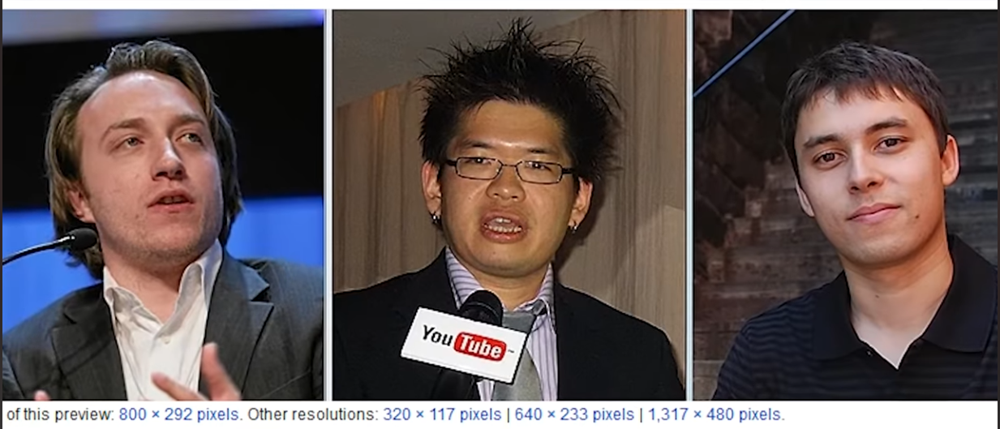

# III Media Sharing

<mark style="color:blue;">**Q:**</mark> <mark style="color:blue;"></mark><mark style="color:blue;">Please create a old to new sorted list of all popular digital media sharing and streaming services, platforms or methods starting from 1990. A list entry should have the syntax "year servicename". Exclude messenger and social network</mark>

<mark style="color:blue;">**A:**</mark>

<mark style="color:blue;">1990 Usenet</mark>

<mark style="color:blue;">1994 RealPlayer</mark>

<mark style="color:blue;">1997 Winamp</mark>

<mark style="color:blue;">1999 Napster</mark>

<mark style="color:blue;">2000 LimeWire</mark>

<mark style="color:blue;">2001 Kazaa</mark>

<mark style="color:blue;">2001 BitTorrent</mark>

<mark style="color:blue;">2001 iTunes</mark>

<mark style="color:blue;">2005 YouTube</mark>

<mark style="color:blue;">2006 Veoh</mark>

<mark style="color:blue;">2007 Hulu</mark>

<mark style="color:blue;">2008 Spotify</mark>

<mark style="color:blue;">2008 Vimeo</mark>

<mark style="color:blue;">2009 SoundCloud</mark>

<mark style="color:blue;">2010 Apple Music</mark>

<mark style="color:blue;">2011 Google Play Music</mark>

<mark style="color:blue;">2011 Twitch</mark>

<mark style="color:blue;">2013 Tidal</mark>

<mark style="color:blue;">2014 Amazon Prime Music</mark>

<mark style="color:blue;">2015 Apple Music</mark>

<mark style="color:blue;">2015 Periscope</mark>

<mark style="color:blue;">2016 Google Photos</mark>

<mark style="color:blue;">2017 YouTube TV</mark>

<mark style="color:blue;">2018 TikTok</mark>

<mark style="color:blue;">2019 Disney+</mark>

Source \[GPT4.2], gpt-4-0314(temp = 0,top\_p=1), valid till: 09.2021, _04.05.2023_

For more information about the development of streaming techniques see:

[https://www.theguardian.com/media-network/media-network-blog/2013/mar/01/history-streaming-future-connected-tv](https://www.theguardian.com/media-network/media-network-blog/2013/mar/01/history-streaming-future-connected-tv)

**III.I WinAmp (1997) vs. Napster (1999)**

**…**

**III.II Napster**† **(1999) vs. BitTorrent (2001)**

**…**

**III.III Napster**† **(1999) vs. I-Tunes (2001)**

**Kontext:** Dieses Beispiel wurde in Shuboffs Buch „Im Zeitalter des Überwachungskapitalismus“ angeführt um den Übergang vom ersten user-zentrierten Internet zu den Massendiensten zu verdeutlichen. Shuboff führt als Hauptargument an, dass Itunes auf den populären Iphones und IPods vorinstalliert war und das Teilen zwischen Geräten ermöglichte. _(vgl. Shuboff)_

Die Verbreitung von Napster wies eine rechtliche Fragen auf. z.B.: Inwieweit dürfen Kopien von lizensierten Werken -hergestellt durch neue Technologien – im Internet verbreitet werden. Wer soll für eine Lizenzverletzung zur Verantwortung gezogen werden ?

_- „After a string of adverse legal decisions, Napster, Inc. began its death spiral on March 6, 2001, when it began complying with a Federal court order to block the transfer of copyrighted material over its peer-to-peer network.“_

_- „in late 2000 and early 2001, some 60 million users around the world were freely exchanging digital mp3 files with the help of the program developed by Northeastern University college student Shawn Fanning in the summer of 1999. “_

_- „but the case that eventually brought Napster down was the $20 billion infringement case filed by the Recording Industry Association of America (RIAA). (…) being decided in favor of the RIAA on February 12, 2001. The decision by the United States Court of Appeals for the Ninth Circuit rejected Napster’s claims of fair use, as well as its call for the court to institute a payment system that would have compensated the record labels while allowing Napster to stay in business. Then, on March 5, 2001, District Court Judge Marilyn Patel issued a preliminary injunction ordering Napster to remove, within 72 hours, any songs named by the plaintiffs in a list of their copyrighted material on the Napster network. The following day, March 6, 2001, Napster, Inc. began the process of complying with Judge Patel’s order. Though the company would attempt to stay afloat, it shut down its service just three months later, having begun the process of dismantling itself on this day in 2001.“_

**Fazit:**

Die Firma Napster besaß ein innovatives Konzept, was durch das für den Heimanwender zugängliche Internet benutzte. Es demokratisierte und dezentralisierte den Austausch von Musikdatein. Durch den großen Mehrwert wurde es von bis zu 60 Millionen Nutzern angenommen. Die freie und unmittelbare Verfügbarkeit bedrohte das Geschäftsmodell von Musik-Publishern, die als Gatekeeper zu den Musik-Tracks agierten. Der befürchtete Umsatzeinbruch löste von den Unternehmen gegenüber eine Klagewelle aus. Napster verlor den Prozess und ging durch die geforderten Strafzahlungen bankrott.

**→ Bei der Entwicklung eines digitalen Produkts ist das Unternehmen gegen mögliche Rechtsstreitigkeiten abzusichern.**

_Quelle: s. \[I-T.1]_ [_https://www.history.com/this-day-in-history/the-death-spiral-of-napster-begins_](https://www.history.com/this-day-in-history/the-death-spiral-of-napster-begins)

_- „Fanning met an ambitious teen, Sean Parker, on the webchat channel w00w00, and together they triggered a series of events that brought the record business to its knees by making music discovery instant – but payment optional. It was not the first service of its kind, but it was the one that went viral. Four months after its June 1999 launch, 150,000 people had signed up. By February 2001, it peaked at a verified 26.4m users, with some estimates topping 80 million.“_ Comment: They met on an IRC chanel. Shawns uncle John Fanning created chess-net.

_- „Richardson was planning a per-track download model – “a dollar a song” – echoing the $0.99 track price that iTunes would offer in 2003. “Why would you spend $17 on a Britney Spears CD and get only two songs that you like?” she asks. “Wouldn’t you prefer to spend $17 and get 17 songs that you like?”“_

_- „But Napster was by now seriously under threat. The RIAA, the trade body representing US record companies, had begun suing the firm in 1999, and acts including Dr Dre and Metallica tried to close it down. In May 2000, the latter delivered 13 boxes of documents to Napster’s offices, listing hundreds of thousands of users suspected of unlawfully sharing their music.“_

_- „_s. “For years, record companies had traded on dodgy numbers. What \[the lawyers] were afraid of was wholesale renegotiation of artists’ contracts triggered by data transparency.”

_zum Business model:_

_- Napster had carried out audience research to determine how many users would pay for music and what they would pay: “If only 2% of the Napster user base converted to paying, it would be incredibly valuable to the sector.”_

_- None of this could save Napster. Rolling legal action against it since December 1999 hobbled its growth and the resulting legal bills drained its resources. In September 2001, Napster agreed to pay copyright owners £20m in a settlement, and by May 2002 it couldn’t pay its staff, who were offered the choice of being laid off or taking a week’s unpaid holiday. Mass resignations ensued. The company filed for bankruptcy protection in June 2002 and the assets were eventually sold to Roxio. It relaunched as a legal service in November 2002, but by then, it was yesterday’s brand._

_→ „_Swedish technologist Daniel Ek was hugely inspired by Napster when developing Spotify, so much so that he brought Sean Parker (Comment: Co-Worker of Shwan) on to his team. Spotify has just passed 100 million paying users (of 217 million users in total); the record business is now back to a £15.15bn ($19.1bn) value last year, though still only half of its 1999 peak.“ „TIMING IS EVERYTHING“

**Fazit:**

Napster entwickelte für die eigene Monetarisierung und auch als Vergleichsangebot / Beteiligung für die Musik-Publisher verschiedene Monetarsierungsmodelle. Eine Variante sah ein Freemium Modell vor, ein anderes 1€ pro Track zu bezahlen. Der Erwerb einzelner Tracks im Vergleich zum Erwerb eines Albums bietet dem Nutzer eine hohe Abdeckung ihrer individuellen Bedürfnisse. Allerdings schränkt es Künstler auch in den Möglichkeiten ein mit ihren Werken zu experimentieren.

Im Gerichtsverfahren überreizte sich das Unternehmen und konnte die Vergleichssumme von 20 Millionen Dollar nicht abdecken. Vermutlich wollte kein weitere Investor Geld vorschießen, da Napster als Neuentwicklung als zu risikoreich angesehen wurde. (?)

Spotify wurde später stark von den Geschäftsmodellen Napster inspiriert und integrierte ehemalige Mitarbeiter in den Betrieb. Zu diesem Zeitpunkt war die Rechtssituation / das Verhältnis zur Musikindustrie schon leichter.

_Quelle: s. \[I-T.2]_ [_https://www.theguardian.com/music/2019/may/31/napster-twenty-years-music-revolution_](https://www.theguardian.com/music/2019/may/31/napster-twenty-years-music-revolution)

**Fazit:** Napster war ein Musik-Sharing Dienst, der in seiner Anfangszeit an Universitäten bekannt wurde, die es wegen der Bandbreiten-Nutzung daraufhin blockierten. „Napster“ war ein Spitzname von dem Begründer Shawn Fanning. Vor Napster wurden Songs von einzelnen Homepages per FTP geladen – mit all ihren Begrenzungen, wie Auswahl, Bandbreite, gleichzeitiger Nutzerzahl und relevanz. Einige Seiten, wie VIP3.lycos.com und scour.net spezialisierten sich auf Musik-Sharing.

Napster versprach über seine ständig wachsenden Katalog (P2P) und einen Suchalgorithmus einen enorm vereinfachten Zugang zu Musik. Außerdem konnte man erstmalig mit Musikstilen aus der ganzen Welt in Kontakt kommen.

_Quelle: Vgl. \[I-T.3]_ [_https://www.spin.com/2011/12/farewell-napster-read-spins-2000-story-about-little-pirate-could_](https://www.spin.com/2011/12/farewell-napster-read-spins-2000-story-about-little-pirate-could)_. Abgerufen am 10.03.2023._

**III.IV WinAmp (1997) vs. YouTube (2005)**

\- Susan Wojicki is Boss of Youtube since February 2014

\- Google bought Youtube for 1.65 billion, now third most visited website (2015),

\- Youtube is free, searcheable, individual and influences public opinion

\- On Aug. 10, Google announced it was renaming itself Alphabet and creating a conglomerate of subsidiaries to pursue wide-ranging ventures from delivery drones to self-driving cars

\- Wojicki studied at stanford college and was a friend of Larry Page and Sergey Brin

\- „If you’re part of Google you have to be analytical.“ Robert Kyncel (global head of buissness) at Employees, - Simplify complicated things

\- In 2007, while in advertising, she orchestrated Google’s purchase of DoubleClick for $3.1 billion, which many Googlers thought was antithetical to the company’s founding principles, because it gave the search giant the dubious honor of being one of the largest users of the Internet tracking devices known as cookies. She held her ground; now most people don’t care about cookies. And Google’s ad-sales business soared. (Of the $66 billion in revenue it brought in last quarter, some 90% came from ads.)

\- „If I see a shortcut, by hiring the right person or buying the right company or building the product one way as opposed to another way,” she says, that’s the route she takes. “I just want to get things done.”

Critizism of Wojikckis Model of YoutTube Kids – Response:

\- Wojicki on YoutTube kids: And an algorithm can’t really calculate the infinite variations in parents’ opinions about what’s appropriate. Millions of parents let their toddlers watch toy unboxing videos.

_-_ YouTube’s most nagging issue: how to create a paid music-video subscription, which it has been promising for at least two years and which several rival companies have already released.

\- kids–hers range in age from 8 months to 15 years–is now a business advantage. They are her first guinea pigs for many of her ideas.

\- User on youtube: The first kind come to the site for a specific video–they’re looking for information or they’ve clicked on somebody else’s link. “Those tend to be older people. But the younger generation has found content that they connect to in a specific way. That content is on YouTube. And it’s not on TV.” They subsribe and interact with the content on comments. “Young people have created a fascinating and complex world of deep engagement online,” (And with each other)

\- Youtube hosts life events for engaements

\- “YouTube is as much a community product as it is an algorithm,” says Hunter Walk, a former Googler and YouTuber, who worked with Wojcicki at AdSense. “It involves humans to a greater degree than some other of Google’s products do.“

**Fazit:**

\-YouTubes ursprünglicher Service selbst, dem individuellen Nutzer eine möglichkeit zu bieten schnell Videos hochzuladen und damit zu interagieren, füllte eine Nische. Dadurch war YouTube schnell (Gründung 14.02.2005) zur dritt meistbesuchten Seite des Internets gewachsen (2015)

\- YouTube wurde von Google 2015 aufgekauft und für das Ad-Marketing eingesetzt. Google konnte dadruch großen Gewinn einfahren.

\- YouTube baut features für verschiedene Zielgruppen, nachdem es ihre Verhaltensweisen ermittelt hat. Jünge Nutzer sind eher zum gegenseitigem Enagement und zum Ausdruck ihrer Subkultur auf der Plattform, ältere Nutzer suchen nach spezifischen Videos oder Klicken eher auf links. Vermutung: YouTube unterstützt jüngere Nutzer mit den automatischen Vorschlägen und ältere Nutzer durch die Integration von diversen Möglichkeiten zum Teilen und Förderung von spezifischen Creatorn.

\- Wojcicki (CEO): YouTube ist erfolgreich,weil über diese Plattform mehr Menschen einbezogen werden können als in andere Google Produkte. Es ist eine Synergie aus Algorithmus und Community.

Ergänzung: Beispiele wie YouTube die Nutzer einbezieht:

\- Like und ehemals Dislike Button

\- Kommentar und Teilfunktion

\- Remix und Advertsiemnt bekannter Künstler

\- Die Playbuttons und offline Meeting events

\- Werbung auf anderen Plattformen

\- Exklusiver Content für Fans (YouTube Red)

\- YouTube Livestreams

_Quelle:\[VS.1] s._ [**https://time.com/4012832/meet-youtubes-view-master/**](https://time.com/4012832/meet-youtubes-view-master/)_]_

_- Article trys to answer three questions:_

RQ1: What are the qualities of user-generated content that make it appealing to viewers?

RQ2: What are similar characteristics that popular YouTubers have in common?

RQ3: How have YouTubers utilized traditional media to help build their personal brand?

By studying the content of three different channels.

_-_ YouTube was one of\
a number of competing services aiming to remove the technical barriers to the widespread sharing of video online. The website provided a very simple, integrated interface within which users could upload, publish, and view streaming videos without high levels of technical knowledge” (p. I)

\- “If the pre-Google era of YouTube is characterized by amateur-produced videos in an\
ad-free environment, the post-Google purchase stage is characterized by professionally generated videos in an ad-friendly environment. Because of YouTube’s popularity, industries have shown a deep interest in monetizing it” (→ Aufmerksamkeit hat Möglichkeit zum Geld verdienen aufgedeckt)

\- Appeal to viewers: the study found a YouTuber’s authenticity appealed to their viewers.

\- This study found that all three YouTubers filmed inside their homes either

sitting on the edge of their beds or at their desk. They have conversations with a camera through vlogging (video blogging). Burgess and Green (2009) explained

\- All three link their other social media platforms to their YouTube account so they can continue to

interact with viewers.→ community feel

→ Creating an enjoyable, personable

environment distinguishes YouTubers from other celebrities. They are being themselves and creating an environment where the viewer feels as though they are listening to their friend speak.

\- Qualities of successfull YouTubers: forms of social engagement inherent in vlogging are key features that distinguish YouTube as a platform for creativity and participation around video, rather than just a repository and distribution system” (Biel & Gatica-Perez, 2011).

\- Youtubers: Creates brands by combining their character, music and formats. Youtubes post once a week.

\- Youtubers overlap with traditional media by transfering their brand to real world

**Fazit:**

\- YouTube hat die Barrieren für ein einfaches Teilen von Videos onlien abgebaut. Dafür hat es diese Funktionen Nutzer ohne technisches Wissen über ein einfaches Interface zugänglich gemacht.

\- Google hatte vermutlich Interesse an YouTube da es bei Nutzern eine hohe Aufmerksamkeit generierte. Nachdem Kauf verwandelte das Unterehmen YouTube unter Wojcicki von einer nutzerzentrierten ad-freien für Amateuervideos in eine creatorzentrierte ad-freundliche Plattform mit höherewertigem Content.

\- YouTubern gelingt es Nutzer durch Authentizität und Enagagement an ihren Content zu binden. Durch das Filmen von VLOGS (Analog zu einem gespräch – bloß mit Kamera) und Teilen des eigenen Lebens kann eine Beziehung gegenüber von YouTubern aufgebaut werden. Durch Einbinden von Themen und Musik gelingt es großen YouTubern aus Ihrer Identität auf YouTube eine Marke zu erzeugen.

\- YouTuber erzeugen über ihren Charakter eine persönlcihe und angenehme Atmosphäre und können sich durch die Features der Plattform (Playlists, Streams, Kommentieren der Zuschauer) ausleben, oder ihre Charaktereigenschaften verstärken.

_Quelle:\[VS.2] s._ [_https://www.elon.edu/u/academics/communications/journal/wp-content/uploads/sites/153/2017/06/06\_Margaret\_Holland.pdf_](https://www.elon.edu/u/academics/communications/journal/wp-content/uploads/sites/153/2017/06/06\_Margaret\_Holland.pdf)

_-_ The company rose like a rocket ship after its founding in 2005, and was bought by Google 18 months late (Founders: Chad Hurley, Steve Chen, and Jawed Karim; California)

\- **On Valentine's Day** 2005, Hurley — as CEO — registers the trademark, logo, and domain for YouTube. The website launches to a small subset of users. However, **YouTube-as-a-dating-site** attracts little interest, forcing the cofounder to take out ads paying women $20 to upload dating videos. Instead, users start uploading videos of all kinds to YouTube“ (see: [https://www.youtube.com/watch?v=La29ZDSzCqk](https://www.youtube.com/watch?v=La29ZDSzCqk)) → Especially people should talk about their ideal relationship online

.png>)Source: [https://www.youtube.com/watch?v=La29ZDSzCqk](https://www.youtube.com/watch?v=La29ZDSzCqk)

\- April 2005 (after 3 months): Changed to a free video hosting platform. ..However, Chen and Hurley say they thought of the idea of YouTube as a place to upload videos they had taken at a party.

\- First Video is „Me in the zoo“ from Karim uploaded to non public youtube beta

_-_ October 2005: YouTube sees a video hit 1 million views for the first time. The video is a viral Nike ad showing Brazilian soccer player Ronaldinho receiving his pair of "Golden Boots," (→ Common Interest)

_- December 2005: Youtube goes out of Beta and has 8 million views a day (!)_

_-February 2006: Request of removal from NBS, Youtube adds copyright system_

_-_ April 2006: A video is uploaded to YouTube showing two boys in China lip-synching to the Backstreet Boys. Susan Wojcicki — YouTube's current CEO, who was in charge of Google's acquisitions at the time — credits this video with convincing her that it would be worth it for Google to invest in user-generated content by purchasing YouTube.

Siehe: [https://www.youtube.com/watch?v=N2rZxCrb7iU](https://www.youtube.com/watch?v=N2rZxCrb7iU)

_- J_une 2006: After the initial spat over the SNL sketch just a few months before, YouTube and NBC strike a deal to help promote the network's upcoming fall TV line up. The move helps the traditional media company enter the new digital age, and marks the beginning of YouTube's several key partnerships with content providers later down the road.

_-_ June 2007: The same month Apple launches its first iPhone model, YouTube launches its mobile site. Hurley, YouTube's CEO, predicts that mobile is "going to be a huge market," making YouTube's mobile site a "natural transition."

_-_ August 2007: Google rolls out its first ads on YouTube videos. Instead of an option for traditional pre-video ads, the company chooses a new in-video format featuring semi-transparent banners that pop up on the lower portion of videos, and can be clicked away after several seconds. (Interaction, small invasiv)

_-_ November 2008: YouTube expands its ad offerings to include sponsored videos and pre-roll ads, a format YouTube long said it wouldn't resort to because those ads were too intrusive to the audience.

However, the benefits paid to brands and advertisers beat out customer experience in the end.

_-_ April 2009: YouTube teams up with media company Vivendi. They together launch a new music video service called Vevo, in response to music companies' complaints about piracy and unfair licensing terms. As part of the deal, Vevo can distribute its music videos on YouTube, setting the groundwork for Vevo's massive YouTube presence today.

_- 2010: Felix Kjellberg Joins Youtube, later known as PewdiePie enters the platform_

_-_ December 2010: YouTube introduces skippable ads with a format called "TrueView," allowing consumers to skip over ads after five seconds and launch straight into the videos they want to watch.

_- 2011 Youtube Live_

_-_ Spring 2011: YouTube plays an instrumental role in a series of anti-government protests, dubbed the Arab Spring, by helping disseminate messages of freedom and democracy. With YouTube, protesters are able to upload videos sharing their messages and political criticism. Many of those videos end up going viral around the world.

_-_ February 2015: After seeing children's content boom, Google launches a "family-friendly" version of the video platform called YouTube Kids. The platform filters content to ensure it's safe for minors, and offers parental controls like limiting screen time and disabling search. Now, YouTube Kids attracts more than 8 million users a week.

_- August 2015: Youtube Gaming after Youtube failed to buy amazoned owned twitch_

_-_ October 2015: YouTube unveils YouTube Red, its subscription service that lets customers watch videos and stream music without ads, as well as access exclusive content featuring major YouTubers. Three years later, YouTube Red is renamed YouTube Premium, and spins off its music-streaming to a separate service called YouTube Music.

_-_ August 2016: YouTube starts notifying creators when their videos are.png>) demonetized — meaning the platform's algorithm has decided some part of the clip doesn't adhere to "advertiser-friendly content guidelines," so it's ineligible to make money. Although these guidelines have existed since 2012, popular creators take notice of their rising impact. YouTuber Philip DeFranco criticizes demonetization as "a form of censorship."

_-_ March 2017: Major companies across the US and in international markets — like AT\&T, Johnson & Johnson, and the British government — pull their ads from YouTube en masse after the Times of London reports that ads are appearing alongside extremist and offensive content

_-_ November 2017: Across YouTube and YouTube Kids platforms, users find regarding family-friendly videos containing disturbing and abusive content. Even more advertisers pull their ads, and YouTube responds by updating its policies around age-restricted content.

_-_ February 2019: YouTuber Matt Watson exposes a "soft-core pedophilia ring" living in the comments on YouTube videos featuring children, where pedophiles trade remarks and links. Another exodus of advertisers occurs, and YouTube responds by disabling comments on videos featuring children.

_-_ September 2019: The Federal Trade Commission fines YouTube $170 million following an investigation into whether the platform violates children's privacy laws by collecting the data of children under the age of 13 without their parents' consent. The FTC settlement also requires YouTube to create a system where creators flag their content as family-friendly.

_-_ December 2019: Six months after the Maza-Crowder controversy, YouTube updates its harassment policy to ban content that "maliciously insults" others — from creators to public figures — on the basis of race, gender, and sexual orientation.

The policy also targets sustained harassment campaigns. However, the revamped policy has led creators to worry about a crackdown on popular types of videos (like commentary and drama) and stoked fear of another Adpocalypse.

**Fazit:**

\- YouTube wurde als Dating-Seite am 14.02.2005 veröffentlicht. Die Entwickler öffneten die Seite allerdings schenll jeder Videosorte, nachdem der Erfolg (hohe Upload und Nutzerzahlen) ausblieb

\- Als Videoupload seite war youtube ungemein erfolgreich, Nutzer hatten Spaß und Freude auf der Website und diese Videos gingen viral und zogen das Interesse großer Investoren an

\- Google erwab Youtube und wandelte sie schritt für schritt in eine werbeorientierte Plattform um, in dem immer intrusivere Werbetechniken in der Plattform eingeführt wurden. Allerdings wurden die Funktionen für Creator auch immer erweitert

\- YouTube half bei der Vereitung politischer Botschaften im arbascihen Frühlung und vereinte Porstestbewegungen

\- Ab 2015 wurde kinderfreundlicher Content und Content über Kinder sehr populär auf YouTube, Google lies deshalb das Format „Yoututbe Kids“ veröffentlichen. Eine YouTube plattform mit stärkeren richtlinien für Videos und Kommentare und anderer Zielgruppe.

\- 2016: YouTube setzt jetzt eine Algorithmus ein, der Videos bei einem vermuteten Verstoß gegen die Richtlinien demonetarisiert.

\- Die Zeit ab 2015 – 2019 war durch mehrere Skandale geprägt, bei denen Ads bei Content gezeigt wurde den die Werbekunden als geschäftsschädigend empfanden, in der folge schränkte YouTube die Richtlinien für Content immer weiter ein.

\- 2019 :YouTube verschärft abrermal die eigenen Richtlinien und beschränkt Hassrede gegenüber öffentlichen Personen und politischen, sozialen und gender Minderheiten.

_Quelle:\[VS.3] s._ [_https://www.businessinsider.com/history-of-youtube-in-photos-2015-10_](https://www.businessinsider.com/history-of-youtube-in-photos-2015-10)

\- „Prior to Youtube, we did have streaming services directly through applications. DivX, Realplayer, Windows Media Player, and WinAmp. You could link your favorite video on a website or wherever and then it would stream each part of the video of encrypted chunks.“ → files have to be zipped, breaking of barrier to publsihers and watchers in compariosion to traditional media

\- Prior to streaming, all videos were downloaded via P2P. Some of the protocols/programs were CuteMX, LimeWire, Gnutella, Gnutella2, Kazaa, or Morpheus

\- „Before that, emails and hyperlinks were the way to share. Video editing software was a pain.“

\- There wasn't one. YouTube invented hosting videos as a service that allowed streaming, right from their website. Before that, you had to put a video on your own website and there was really no way to generate traffic for your video

**Fazit:**

\- Folgende Möglichkeiten existierten vor Youtube Videos zu streamen: 1. Veröffentlichen des Videos auf einer eigenen Website und tdownlaod von dieser, Telen des Links. 2. P2P Plattformen mit Client, 3. Medienbilbliotheken, Streamign eines Videos mit Anwendungen

\- YouTube setze erstmalig ein einfaches Videostreaming im Browser, den viele Menschen auf ihren PCs vorinstalliert hatten

_Quelle: \[VS.4] s._ [_https://www.quora.com/Before-YouTube-what-was-the-video-browser-that-people-used_](https://www.quora.com/Before-YouTube-what-was-the-video-browser-that-people-used)

_-_ Der Artikel ist aus der Sicht eines Autors geschrieben, der mit seinen Gedanken und Themen eine große Audienz erreichen will, um eventuell damit Geld zu verdienen. Der Autor erlebt durch die Informationsvielfalt im Internet wahrscheinlich hohe Konkurrenz. Um relevante Inhalte anbieten zu können muss er für seinen Blog zunehmend Zeit investieren. Allerdings gelingt es ihm nicht die eingebrachte Zeit und die Anzahl der erreichten Leser in Waage zu halten.

\- Blogs waren aus Sicht eines Autors immer dazu gedacht Publikum zu erreichen und zu halten

_-_ Eine solche Plattform muss nach der Meinung des Autors folgende Eigenschaften erfüllen:

_Sicht des Content Creators:_

I) Inhalt muss leicht zugänglich gemacht werden können (Publishing)

Kommentar: Diese Funktion bieten alle modernen CMS Systeme und Social Media Plattformen.

_Sicht der Nutzer:_

II) Die Plattform muss leicht auffindbar sein (Suchbarkeit)

Der Autor unterscheidet nach den Absichten der Menschen. Menschen suchen auf Twitter Redit und Google nur kurzweilige Unterhaltung oder die Antwort auf eine Frage. Zur Interaktion mit dem Autor kommt es nie. Die Entdeckung der Nutzer verschwindet sofort wieder. Wenn dabei der Blog entdeckt wird interessiert der Blog und der Autor nicht. Die großen Plattformen wie Google, zeigen oft sogar nur noch die Antwort an und begrenzen damit die Klicks auf die Blogs.

Im Web 1.0 haben die Blogs selbst noch ähnlichen Content empfohlen. Statt automatisierten Algorithmen musste man mit den vom Blogautor vorgeschlagenen Links interagieren. Heute verlinkt kaum jemand noch Blogs und Inhalte manuell. Der Prozess des Suchens als Interaktion entfällt komplett.

Es gibt heute keine populäre Plattform um speziell nach Blogs zu suchen. Für Fotos und Podcast funktioniert es über andere Plattformen.

III) Man muss der Plattform leicht folgen können (also in Verbindung bleiben, Abonnement)

The Web 1.0 days had a call-to-action with each article you discovered. You’d find an author through social discovery but then you could easily subscribe (by RSS ..). Kommentar: Das war auch nötig, da es neben RSS und Lesezeichen kaum eine Möglichkeit gab mit neuem Content von Autoren versorgt zu werden, die man erst mühsam aufgefunden hatte.

Google Facebook und Twitter sortieren für mich vor und lassen mich nicht nur abbonieren, was ich suche.

IV) Das Publikum muss sich leicht und dauerhaft beteiligen können (Engagement)

Autoren wollen Beteiligung, Reaktion und Diskussion. In persönlichen Blogs sind die Kommentare aber oft wegen der Art der Diskussion abgeschalten.

Abschließend folgert der Autor, dass sich durch die gravierenden Wettbewerbsnachteile Blogs nicht mehr finanzieren werden. Er gibt eine kurze Übersicht über weitere Medientypen, auf denen man Inhalte publizieren kann.

Email-Newsletter:

Der Autor empfindet E-Mails als ungeeignet.

\- Privacy – do you want each blogs to have your email ?

\- Spam – is your inbox the right place to read articles?

\- Format – email is notorious for screwing up images and format !

\- Analytics – hard to tell if people read your content unless you pixel track them.

\- Sharing – Once it’s in email, it’s harder for people to share it without clipping, re-posting or forwarding the email… More spam.

→ Wichtig scheint es zu sein, das Artikel und Informationen in einem passenden Umfeld präsentiert werden. Für komplexere Blog-Artikel ist ein E-Mail Postfach zu unsortiert und die E-Mail zu schwer für den Publisher zu kontrollieren. Das Problem mit dem Tracking tritt bei dem Nutzer ebenfalls auf, wenn er Social Media nutzt… Sharing ist nicht so einfach, da E-Mail Programme selten andere Nutzer vorschlagen oder geteilte E-Mails Priorisieren. E-Mails besitzen im Vergleich zu Social-media Posts keine standardmäßigen emotionalen Interaktionsmöglichkeiten (Like).

\- Buch: sehr viel Aufwand... „When I looked at options for long-form content, there were few. I could write a book, but all the authors I talked to said this **wasn’t a good way to build long-term audience. You’d have to focus on writing and publish many books to build an audience.**

**“**→ Verstärkung des Problems derZeitinvestition.

\- Podcast: lohnen sich nicht, weil sie verhältnismäßig schlecht gefunden werden. Kommentar: Das hat sich 2021 durch das aufkommen der Corona-Krise und verstärkter Gewichtung in den Musik-Apps kurzzeitig verändert.

Youtube: Favorit des Autors, Große, Wachsendes Publikum, viele Nischen zu denen es kaum Producer gibt, viele Konsumenten, Publikum wächst logarithmisch stark. In Youtube hat der Nutzer hohen Einfluss auf den Inhalt den er als nächstes sieht:

* First is the obvious. Each viewer c**an directly engage in content: watch, subscribe, like, **~~**dislike or**~~** comment.**
* Secondly each viewer **influences the recommendations of other viewers passively.** This is done because YouTube calculates the mutual overlap of both videos and viewers. Said another way, if many people watch videos A, B & C and you’ve watched A & C, it’s very likely that video B will be recommended.
* **The recommendations appear to also be true around creators.** So if many people follow creators X, Y & Z and you’ve only been exposed to creator Z & Y, it’s likely that YouTube will recommend popular videos from creator X.
* **Individual searches and watch time** also influence YouTube’s **understanding of the videos relevance.** So engagement has a re-enforcing impact on search and discovery.-
* Content – While content isn’t easy to create, it’s very easy to consume and travels well to mobile devices. → More consumer than producer
* Discovery – Google is the largest search engine and YouTube is the second largest search engine. Combined from a traffic and discovery standpoint this is a huge advantage.
* Subscription – Yes, mostly. You still have to compete for attention from organically suggested content. E**ven subscribers may not always see your content. While this has some drawbacks it does help ensure that one terrible video doesn’t tank your entire audience.**
* Engagement – While comments on YouTube had been very toxic in the past the trend to **better moderation, filtering and engagement** appears to be working.

**Fazit:**

Der Autor beschreibt die Dimensionen Veröffentlichungshürde (Puplishing), Suchbarkeit, Abonnierbarkeit und Engagement als entscheidende Dimensionen, um eigenen Content über ein Medium zu verbreiten. Er stellt fest, dass Blogs- und Blogsysteme in all diesen Dimensionen großen Social Media Plattformen (hier: Youtube) unterlegen sind. Indirekt spricht er auch mehrfach die Vermeidung von Spam an, dies führe ich hier als Dimension „Relevanz“ ein. Es folgt eine Auflistung weiterer Medien und ihrer Vor-und Nachteile.

_Quelle: \[SocM.1] vgl._ [_https://gregraiz.com/why-blogs-died/_](https://gregraiz.com/why-blogs-died/)

| Medium            | Veröffentlichungshürde                                                                                     | Suchbarkeit                                                                                                                                                                                                                                                                                                | Abonnierbarkeit                                                                                                                                                                                                                                                                 | Engagement                                                                                                                                                                                                                                                                  | Relevanz der Inhalte                                                                                                                                                                                      |
| ----------------- | ---------------------------------------------------------------------------------------------------------- | ---------------------------------------------------------------------------------------------------------------------------------------------------------------------------------------------------------------------------------------------------------------------------------------------------------- | ------------------------------------------------------------------------------------------------------------------------------------------------------------------------------------------------------------------------------------------------------------------------------- | --------------------------------------------------------------------------------------------------------------------------------------------------------------------------------------------------------------------------------------------------------------------------- | --------------------------------------------------------------------------------------------------------------------------------------------------------------------------------------------------------- |
| Blog              | Mittel, Installation / Anmeldung auf Blogsystem, Aufsetzen einer Homepage                                  | Niedrig, es existiert kein primäres Medium um speziell Blogartikel und Homepages aufzufinden. Google nur über Search Engineering.                                                                                                                                                                          | Niedrig, Blogs besitzten standardmäßig keine Abofunktion. Allerdings können Leser durch RSS, Feed, Social Media Account oder Newsletter länger gebunden werden.                                                                                                                 | Mittel, Die Nutzer von Blogs können über Kommentare und Gästebücher mit den Beiträgen interagieren. Die Moderation dieser Kommentar überfordert jedoch viele Blogschreiber, die diese deshalb aktivieren.                                                                   | Niedrig – Hoch, Sollte der Autor mit seinem Blog ein möglichst großes Publikum erreichen wollen, bleibt ihm nur Themen aus seinem Leben/ Umfeld aufzugreifen, oder den Trends auf Social Media zu folgen. |
| E-Mail Newsletter | Hoch, Nutzer muss Verwendung seiner E-Mail zustimmen. Formatierungsprobleme                                | Sehr niedrig, In der Regel wird auch nicht nach E-Mail Newslettern gesucht, da der erwartbare Content unklar ist.                                                                                                                                                                                          | Mittel, E-Mail Newsletter basieren grundsätzlich auf einem Abo-Prinzip, bei dem der Nutzer seine E-Mail Adresse und seine Zustimmung digital abgibt. Grundsätzlich müssen Newsletter nun leicht abgemeldet werden können. Werden in der Praxis aber einfach nicht mehr gelesen. | Niedrig, für ein Engagement mit den Mails ist das umständliche Absenden einer eigenen Mail oder das Reposten notwendig.                                                                                                                                                     | 
 
                                                                                                                                                                                               |
| Buch              | Hoch, Finanzielles Risiko und Abhängigkeit von Verleger                                                    | Mittel – Hoch, Bücher können durch Social Media und Auslage in Buchhandlungen hohe Popularität erlangen.                                                                                                                                                                                                   | Niedrig, außer durch Einsatz von Drittmedien und Flyern ist eine Bindung an neue Inhalte kaum möglich.                                                                                                                                                                          | Niedrig, Der Inhalt von Büchern verbreitet sich meist per Mundpropaganda und die Anwesenheit im Bücherregal. Der Nutzer kann über Leserbriefe interagieren                                                                                                                  | 
 
                                                                                                                                                                                               |
| Podcast           | Niedrig, Podcasts können auf diversen Medieplattformen veröffentlicht werden                               | 
Mittel, Podcasts sind auf Medienplattformen zwar äußert leicht findbar, aber es gibt einen hohen Konkurrenzdruck

→ Manchmal kann ein Podcast viral gehen, wie bei YouTube
                                                                                                                     | Hoch, Durch die Veröffentlichung auf Social Media Kanälen und regelmäßigen Uhrzeiten, kann eine hohe Hörerbindung erreicht werden.                                                                                                                                              | Hoch, Leserkommentare können in den Podcast einbezogen werden. Podcasts können als Liver-Version aufgenommen werden.                                                                                                                                                        | 
 
                                                                                                                                                                                               |
| YouTube           | Niedrig, jeder mit Account ist Creator. Allerdings stellt YouTube hohe inhaltliche Anforderungen an Videos | 
Mittel – Hoch. YouTube liefert über das Abonement, die Startseite und Kanäle mehrere Kanäle in denen dein Video gefunden werden kann. YouTube besitzt ein Suchfeld, dessen Ergebnisse Videos mit ähnlcihen Inhalt und Titel wiedergibt.

Die Menge der Nutzer ist höher als bei Podcasts.. (?)
 | 
Mittel, Abonnements sind zwar möglich, dennoch bekommt nicht jeder Abonnent alle Videos eines Kanals zu sehen, da der Algorithmus immernoch Videos priorisiert usw.

Abonnentnen können Benachrichtigungen direkt auf ihr Smartphone erhalten.
                      | 
Hoch, Jeder Nutzer kann den Content anschauen , abonnieren, liken, kommentieren und teilen. Youttuber besitzen die möglichkeit eine Art blogposts abzugeben und shorts zu erstellen.

YouTube Kommentare werden automatisiert und bei Bedarf manuell moderiert.
 | 
 
                                                                                                                                                                                               |

**III.V YouTube (2005) vs. Twitch (2011)**

**...**

**III.V Youtube (2005) vs. PeerTube (2017)**

**...**
